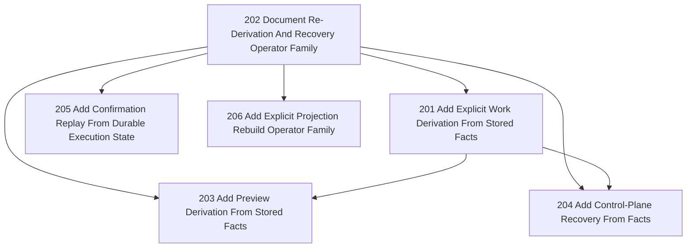

# Tasks 201-206 Reduced DAG

## Reading

- `202` defines the family and the semantic distinctions.
- `201` is the first operational member: replay work derivation from stored facts.
- `203` depends on the same bounded fact-selection and canonical derivation path, but remains read-only.
- `204` builds on `201` to recover control-plane derivation from facts after loss/drift.
- `205` is a sibling family member at a later boundary: execution/outbound to confirmation.
- `206` is a sibling family member for non-authoritative rebuilds and can proceed once the family is named.

## Recommended Order

1. `202`
2. `201`
3. `203`
4. `204`
5. `205`
6. `206`
