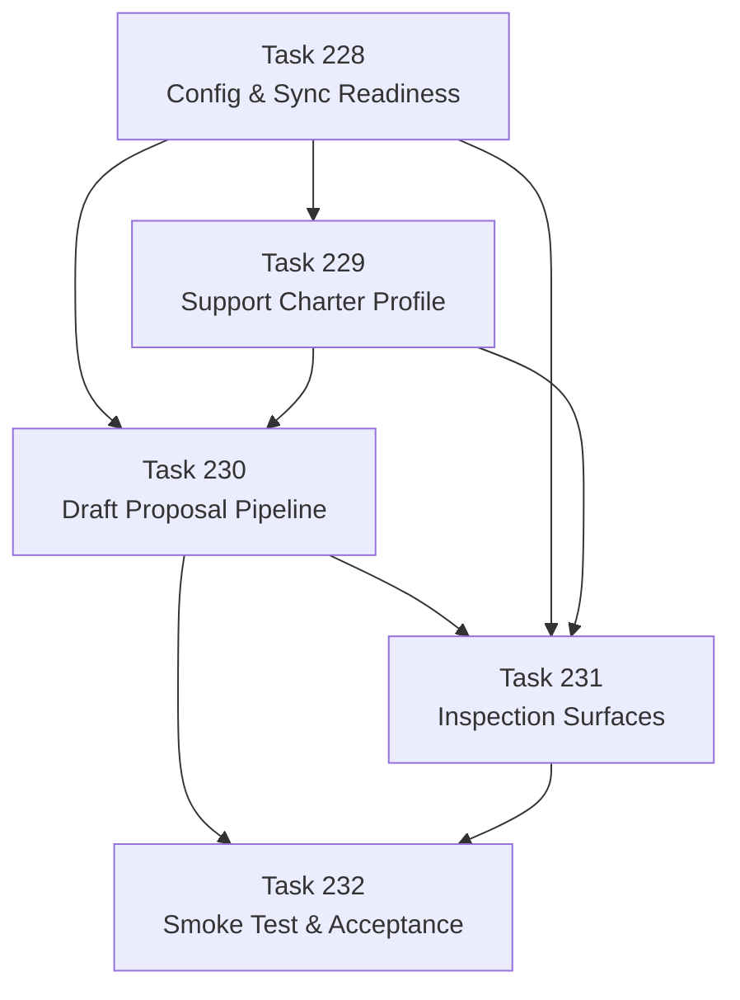

# Live Operation Chapter DAG: Tasks 228-232

## Task Ordering Rationale

- **228 → 229**: The charter profile needs synced messages/facts to verify against real context.
- **228 → 230**: Pipeline verification needs facts.
- **229 → 230**: Pipeline verification needs the support charter to produce sensible proposals.
- **230 → 231**: Inspection surfaces need evaluations, decisions, and executions to exist before they can be exposed.
- **230 → 232**: Smoke test needs the proven pipeline.
- **231 → 232**: Smoke test acceptance includes operator inspection capability.
