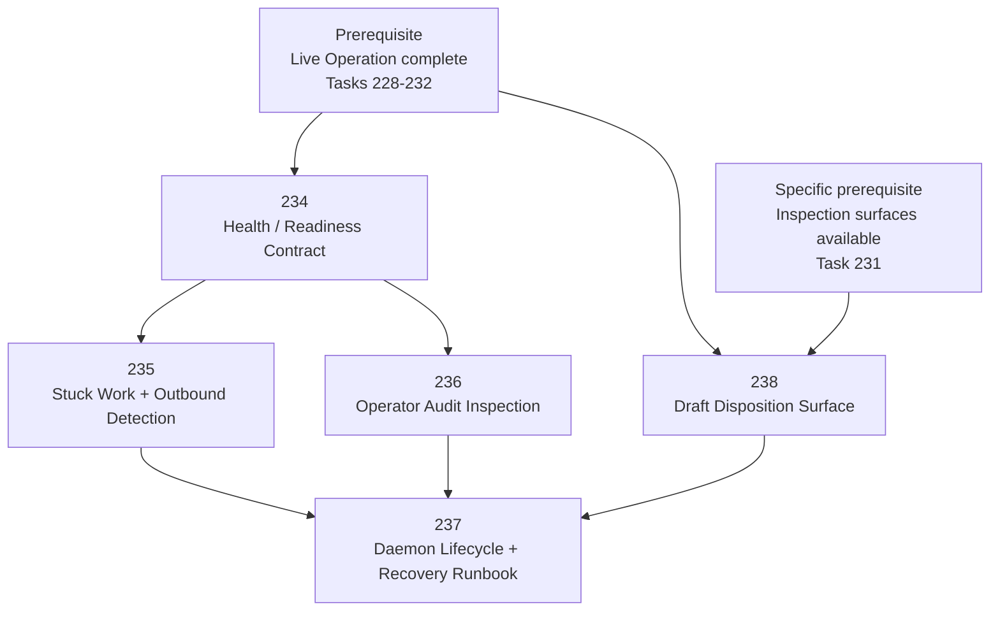

# Operational Trust Chapter DAG: Tasks 234-238

This DAG covers the **Operational Trust** chapter only.

Live Operation tasks `228-232` are prerequisites, not part of this chapter. They are compressed into prerequisite nodes so the graph does not imply that Operational Trust owns the Live Operation task range.

## Task Ordering Rationale

- **Live Operation complete → 234**: Health and readiness reporting only becomes meaningful after the system has real sync, work, evaluation, outbound, and inspection paths.
- **Live Operation complete → 238**: Draft disposition only matters once managed drafts can be produced.
- **Task 231 → 238**: Operators must be able to inspect drafts before they can reject, mark reviewed, or record external handling.
- **234 → 235**: Stuck-work detection feeds the health/readiness contract; first define what healthy means, then detect deviations.
- **234 → 236**: Audit inspection uses the same observation/API/CLI framing as health readiness.
- **235 → 237**: Recovery runbooks must reference stuck-work and stuck-outbound classifications and thresholds.
- **236 → 237**: Recovery runbooks must reference audit inspection to verify operator actions during incidents.
- **238 → 237**: Recovery runbooks must include procedures for cleaning up stuck or externally handled drafts.
- **237 is the capstone**: daemon lifecycle and recovery documentation should integrate the surfaces created by 234, 235, 236, and 238.

## Operational Trust Tasks

| Task | Name | Role |
|------|------|------|
| 234 | Health / Readiness Contract | Defines what “live”, “sync healthy”, “dispatch ready”, and “outbound healthy” mean. |
| 235 | Stuck Work + Outbound Detection | Detects stagnation before it becomes silent operational failure. |
| 236 | Operator Audit Inspection | Makes human/system interventions inspectable through API, CLI, and UI. |
| 237 | Daemon Lifecycle + Recovery Runbook | Documents and hardens start, stop, restart, failure recovery, and daily operation. |
| 238 | Draft Disposition Surface | Lets operators reject, mark reviewed, or record external handling for draft-only operation output. |

## Deferred Capabilities

| Capability | Why Deferred |
|------------|--------------|
| Full draft approval workflow (`approve → send`, edit, multi-step review) | Minimal disposition is enough for draft-only Operational Trust. Full send approval belongs to a later autonomous-send chapter. |
| Autonomous send (`require_human_approval: false`) | Safety boundary; deferred until Operational Trust is proven. |
| Scheduled / automated backup | Manual `narada backup` is sufficient for one live operation. |
| Production runtime telemetry export (Prometheus, OpenMetrics, etc.) | `.health.json`, status output, and observation API are enough for local operation. |
| Credential hardening in CLI / ops-kit secure storage | Environment variables are acceptable for the first operation. |
| Multi-operation supervision | This chapter trusts one operation, not a fleet. |
| Real-time alerting (webhooks, PagerDuty, email) | Polling-based health checks are sufficient for first operational trust. |
| Configuration reload without restart | Restart is acceptable for the first operation. |
