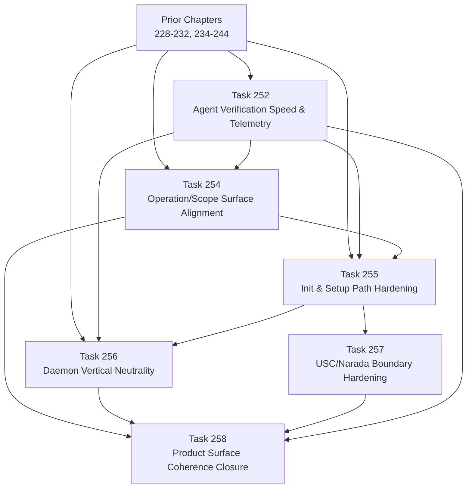

# Product Surface Coherence Chapter DAG: Tasks 252, 254-258

## Task Ordering Rationale

- **Prior → 252**: Verification speed/telemetry is a prerequisite for all other Product Surface tasks because they rely on the verification ladder being fast and correct.
- **Prior → 254**: Terminology alignment is foundational; subsequent tasks should use the correct user-facing vocabulary.
- **Prior → 255**: Init path is independent of terminology but should use aligned naming.
- **Prior → 256**: Daemon vertical neutrality is independent but touches similar files.
- **252 → 254/255/256**: Mechanical verification policy (owned by 252) must be stable before Product Surface tasks are validated.
- **254 → 255**: Init path commands (`want-mailbox`, `init-repo`) should emit "operation" in their output and args.
- **255 → 256**: Setup path validation (preflight, doctor) should work for non-mail operations.
- **255 → 257**: USC init generates ops repos; the repo shape must be stable before pinning the USC contract.
- **254/256/257/252 → 258**: Closure reviews all deliverables.
