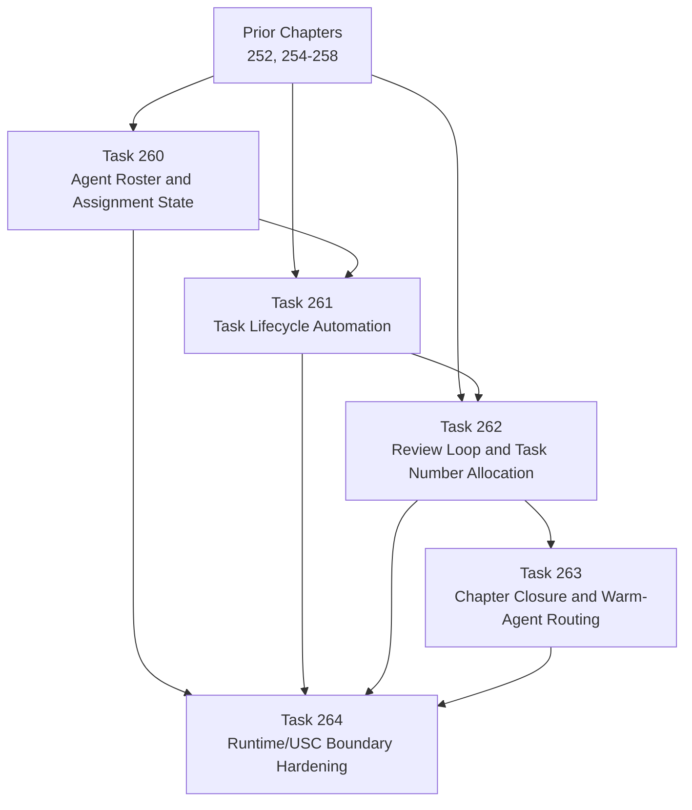

# Multi-Agent Task Governance Chapter DAG: Tasks 260-264

## Task Ordering Rationale

- **Prior → 260**: Agent roster is foundational; all other governance capabilities assume agent identity exists.
- **Prior → 261**: Task lifecycle can be defined in parallel with roster, but claim semantics require roster fields.
- **Prior → 262**: Review loop and number allocation are independent of lifecycle mechanics but should use stable task identifiers.
- **260 → 261**: Task claim requires an agent identity to claim against.
- **261 → 262**: Review loop operates on tasks that have completed their lifecycle; number allocation should respect lifecycle state.
- **262 → 263**: Chapter closure verifies all prior tasks are complete; warm-agent routing depends on assignment history from 260.
- **260/261/262/263 → 264**: Boundary hardening documents the split between runtime and static grammar after all governance mechanics are in place.
