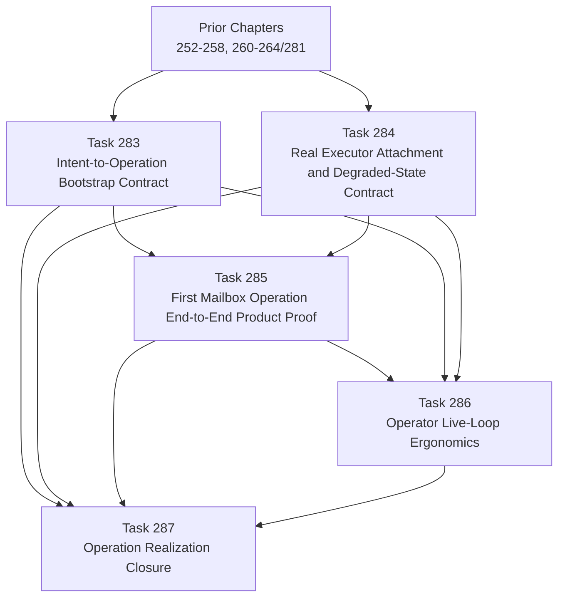

# Operation Realization Chapter DAG: Tasks 283-287

## Task Ordering Rationale

- **Prior → 283**: The bootstrap path depends on the surface and governance work already done.
- **Prior → 284**: Executor/degraded-state framing depends on prior product-surface and governance clarity.
- **283 → 285**: The first real proof should use the canonical bootstrap path, not invent a side path.
- **284 → 285**: The proof must use the real executor/degraded-state contract, not a mock-only narrative.
- **283/284/285 → 286**: Operator ergonomics should be shaped around the actual realized operation path.
- **283/284/285/286 → 287**: Closure reviews the whole chapter as one operational story.
