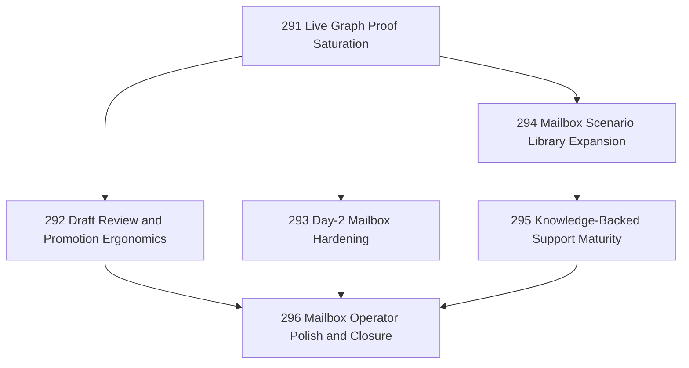

```mermaid
flowchart TD
  T291[291 Live Graph Proof Saturation]
  T292[292 Draft Review and Promotion Ergonomics]
  T293[293 Day-2 Mailbox Hardening]
  T294[294 Mailbox Scenario Library Expansion]
  T295[295 Knowledge-Backed Support Maturity]
  T296[296 Mailbox Operator Polish and Closure]

  T291 --> T292
  T291 --> T293
  T291 --> T294
  T292 --> T296
  T293 --> T296
  T294 --> T295
  T295 --> T296
```
