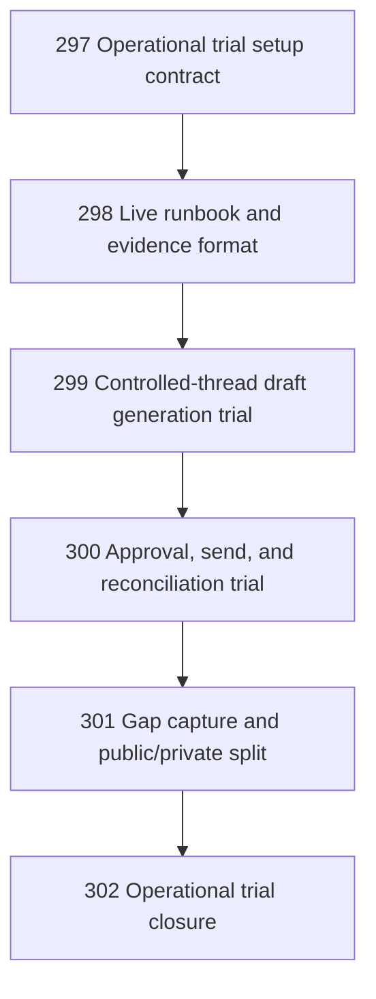

# Mailbox Operational Trial Chapter

Status: closed

## Goal

Prove Narada can run one real mailbox operation end-to-end in an operational repo, with private evidence captured outside the public source repo and public follow-up tasks created only for product/code/doc gaps.

Target operation: `help@global-maxima.com` in `/home/andrey/src/narada.sonar`.

## DAG

## Chapter Rules

- Public repo (`narada`) may contain task files, generic docs, code changes, redacted summaries, and public gap tasks.
- Private ops repo (`narada.sonar`) owns live config, credentials, message bodies, Graph IDs, mailbox evidence, and operator run logs.
- No task may copy live email content, secrets, tenant-specific tokens, or raw Graph payloads into `narada`.
- Live sending requires explicit human/operator approval in the task evidence before execution.
- Agents must use focused verification. Broad suites require explicit justification.

## Closure Criteria

- A real mailbox operation has a documented setup contract.
- There is a repeatable runbook for sync, draft generation, approval, send, reconciliation, and inspection.
- At least one controlled thread reaches draft generation, or a concrete blocker task exists.
- If sending is executed, the result is reconciled or a concrete blocker task exists.
- Public gaps are separated from private operational evidence.
- The chapter closes with an honest decision artifact and changelog entry.
