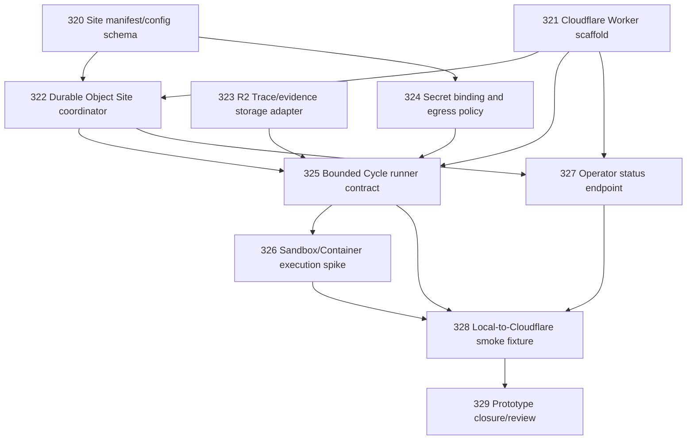

# Cloudflare Site Prototype Chapter

Status: closed

## Goal

Implement the first Cloudflare-backed Narada Site prototype, as designed in Task 308.

The prototype target (from [`docs/deployment/cloudflare-site-materialization.md`](../../docs/deployment/cloudflare-site-materialization.md)):

```text
One Cloudflare Worker
+ one Durable Object
+ one R2 bucket
+ one Cron Trigger
+ one minimal Sandbox/Container proof
```

can execute **one bounded mailbox Cycle** for **one configured Aim-at-Site binding**, write health/Trace, and expose a **private operator status endpoint**.

## DAG



## Chapter Rules

- Use `Aim / Site / Cycle / Act / Trace` vocabulary (see [`SEMANTICS.md §2.14`](../../SEMANTICS.md)).
- Do not invent provider-neutral deployment abstractions before the Cloudflare path is proven.
- Each task must be reviewable independently.
- No task may rename CLI flags, DB columns, or runtime APIs.
- Live credentials or secrets must never be committed to the public repo.

## Task Files

| # | Task | File |
|---|------|------|
| 320 | Site manifest/config schema for Cloudflare materialization | [`20260420-320-cloudflare-site-manifest-schema.md`](20260420-320-cloudflare-site-manifest-schema.md) |
| 321 | Cloudflare Worker scaffold and package boundary | [`20260420-321-cloudflare-worker-scaffold.md`](20260420-321-cloudflare-worker-scaffold.md) |
| 322 | Durable Object Site coordinator — lock, health, compact state | [`20260420-322-durable-object-site-coordinator.md`](20260420-322-durable-object-site-coordinator.md) |
| 323 | R2 Trace/evidence storage adapter | [`20260420-323-r2-trace-storage-adapter.md`](20260420-323-r2-trace-storage-adapter.md) |
| 324 | Secret binding and egress policy design | [`20260420-324-secret-binding-and-egress-policy.md`](20260420-324-secret-binding-and-egress-policy.md) |
| 325 | Bounded Cycle runner contract | [`20260420-325-bounded-cycle-runner-contract.md`](20260420-325-bounded-cycle-runner-contract.md) |
| 326 | Sandbox/Container execution proof spike | [`20260420-326-sandbox-execution-proof-spike.md`](20260420-326-sandbox-execution-proof-spike.md) |
| 327 | Operator status endpoint | [`20260420-327-operator-status-endpoint.md`](20260420-327-operator-status-endpoint.md) |
| 328 | Local-to-Cloudflare smoke fixture | [`20260420-328-local-to-cloudflare-smoke-fixture.md`](20260420-328-local-to-cloudflare-smoke-fixture.md) |
| 329 | Prototype closure/review | [`20260420-329-prototype-closure-review.md`](20260420-329-prototype-closure-review.md) |

## Closure

Closed: 2026-04-21

Closure artifacts:
- Operational: [`.ai/decisions/20260421-329-cloudflare-prototype-closure.md`](../decisions/20260421-329-cloudflare-prototype-closure.md)
- Ontology: [`.ai/decisions/20260421-330-cloudflare-site-ontology-closure.md`](../decisions/20260421-330-cloudflare-site-ontology-closure.md)

### Summary

All nine implementation tasks (320–328) delivered. The prototype is a successful **structural proof**: Worker + DO + R2 + Sandbox can host a Narada Site with bounded-Cycle mechanics, lock lifecycle, health/trace read/write, Bearer auth, and smoke verification.

The gap between this prototype and a production-ready Cloudflare Site is the **porting of the Narada kernel itself** (sync, normalize, fact admission, context formation, charter evaluation, foreman governance, outbound handoff, reconciliation) into the Cycle runner. This is a substantial but well-scoped v1 effort.

### Closure Criteria (all satisfied)

- ✅ Site manifest schema validates a Cloudflare-backed Site config.
- ✅ Worker package builds and has a clean package boundary.
- ✅ Durable Object holds per-Site lock, health, and compact state.
- ✅ R2 adapter reads and writes Site-scoped Trace artifacts.
- ✅ Secrets bind to the Site via Worker Secrets with per-Site naming (documented).
- ✅ Cycle runner executes one bounded 8-step Cycle (steps 2–6 are placeholder no-ops in v0).
- ✅ Sandbox/Container can execute a bounded no-op or cycle-smoke payload; full charter/tool runtime is v1.
- ✅ Operator status endpoint returns health and last-Cycle summary.
- ✅ Smoke fixture proves one mailbox Cycle end-to-end without live credentials.
- ✅ Closure review documents gaps and v1 decisions.
