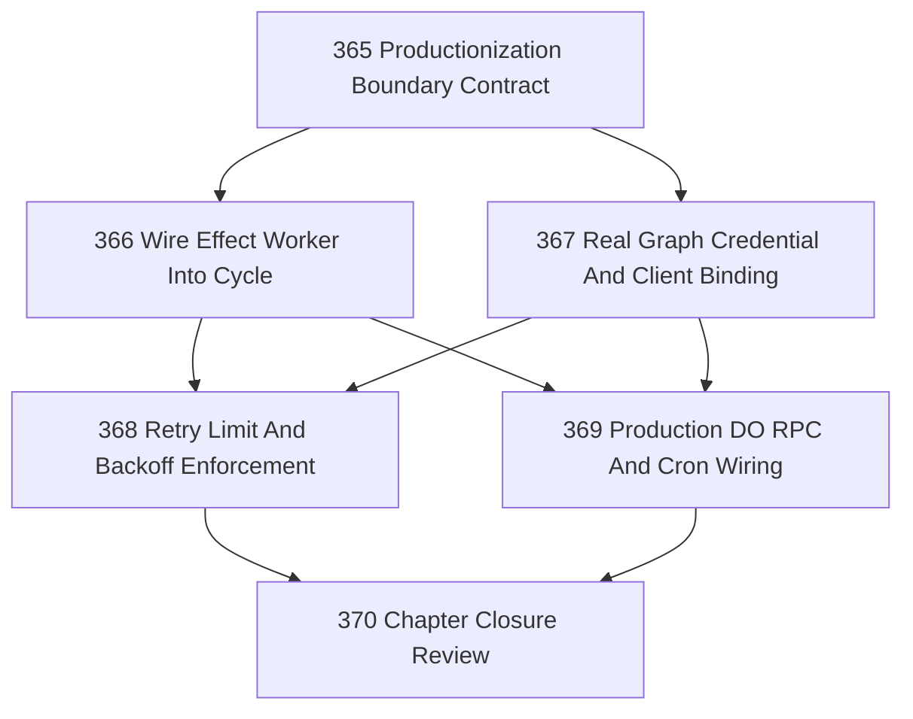

# Cloudflare Site v1 Productionization Chapter

## Assignment

Execute this chapter by assigning the individual task files `365` through `370`.

Do not execute this chapter file directly except for chapter-level review.

## Goal

Move Cloudflare Site from bounded mocked effect-execution proof toward v1 production mechanics without claiming full production readiness.

The chapter should attach effect execution to the Cycle, introduce real credential/client binding seams, enforce retry limits, and prove scheduled/RPC production substrate boundaries in a controlled way.

## CCC Posture

| Coordinate | Current State | Target If Verified | Evidence Required |
|------------|---------------|--------------------|-------------------|
| semantic_resolution | `0` | `0` | No new ontology beyond Site/Cycle/Act/Trace unless explicitly justified |
| invariant_preservation | `0` | `0` | Approval before execution; submitted before confirmed; observation before confirmation |
| constructive_executability | `+1 wider scoped` | `+1 production-shaped` | Effect worker participates in Cycle with retry and credential seams |
| grounded_universalization | `0` | `0` | Stay Cloudflare-specific; no generic Site abstraction |
| authority_reviewability | `0` | `0` | Operator action, execution attempt, and reconciliation evidence remain inspectable |
| teleological_pressure | `0` | `+1 bounded` | Useful unattended execution mechanics without production overclaim |

## DAG

## Task List

| Task | Purpose |
|------|---------|
| 365 | Define productionization boundary, overclaim limits, and v1 acceptance posture |
| 366 | Wire approved-only effect worker into the Cloudflare Cycle as an explicit step |
| 367 | Add real Graph credential/client binding seam without performing live sends in tests |
| 368 | Enforce per-command retry limits and bounded backoff for effect execution |
| 369 | Prove production substrate boundaries: Worker→DO RPC and Cron-triggered Cycle entry |
| 370 | Close chapter with evidence, residuals, CCC posture, and next-work recommendations |

## Chapter Rules

- No evaluator may execute effects.
- No effect may execute without `approved_for_send`.
- API success may only produce `submitted`.
- `confirmed` requires reconciliation observation.
- Real Graph credentials may be wired as a seam, but tests must use mocked clients unless the task explicitly asks for a live manual trial.
- Do not extract a generic Site abstraction in this chapter.
- Do not create derivative task-status files.

## Closure Criteria

- [x] Boundary contract exists and is referenced by implementation tasks.
- [x] Effect execution can be invoked as part of a Cycle.
- [x] Graph credential/client binding seam exists and is testable without live credentials.
- [x] Retry limits and backoff are enforced.
- [x] Worker→DO RPC and Cron entry are fixture-proven or honestly residualized.
- [x] Closure records no-overclaim review and CCC posture.

## Closure Summary

Chapter closed. Full assessment, no-overclaim review, authority boundary review, CCC posture, residuals, and next-work recommendations are recorded in `.ai/decisions/20260421-370-cloudflare-site-v1-productionization-closure.md`.

## Execution Notes

Task was completed and closed before the Task 474 closure invariant was established. Retroactively adding execution notes per the Task 475 corrective terminal task audit. Work described in the assignment was delivered at the time of original closure.

## Verification

Verified retroactively per Task 475 corrective audit. Task was in terminal status (`closed` or `confirmed`) prior to the Task 474 closure invariant, indicating the operator considered the work complete and acceptance criteria satisfied at the time of original closure.
