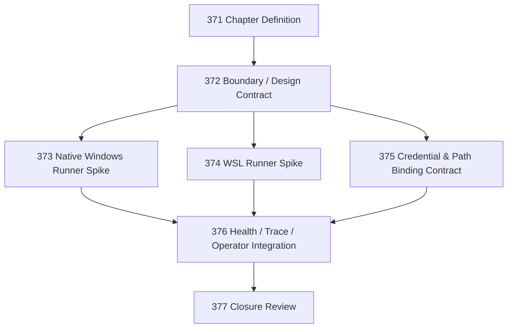

# Windows Site Materialization Chapter

## Goal

Make the Windows family an explicit, self-standing Site substrate sibling to Cloudflare. Define native Windows and WSL materializations, implement bounded Cycle runners for both, and integrate them with the operator loop and unattended operation layer.

## DAG

## Active Tasks

| # | Task | Name | Purpose |
|---|------|------|---------|
| 1 | 372 | Windows Site Boundary / Design Contract | Validate design into actionable boundary contract; identify reuse inventory |
| 2 | 373 | Native Windows Runner / Supervision Spike | PowerShell + Task Scheduler + SQLite lock proof |
| 3 | 374 | WSL Site Runner / Supervision Spike | systemd/cron + SQLite lock proof inside WSL 2 |
| 4 | 375 | Credential and Path Binding Contract | Canonical secret resolution and filesystem path binding |
| 5 | 376 | Health, Trace, and Operator-Loop Integration | Connect Windows Sites to `narada status`, `narada doctor`, `narada ops` |
| 6 | 377 | Windows Site Materialization Closure | Semantic drift check, gap table, generic Site abstraction decision |

## Chapter Rules

- Use the hardened vocabulary from SEMANTICS.md §2.14. No `operation` smear.
- Native Windows and WSL are distinct substrate variants, not one unified "Windows" target.
- No generic Site abstraction unless Tasks 372–377 prove enough commonality to justify extraction.
- No Windows Service production claim unless explicitly implemented.
- No conflation of Windows Site with mailbox vertical.
- No hidden dependence on the developer's current machine layout.
- Live credentials or secrets must never be committed.

## Task Files

| # | Task | File | Status |
|---|------|------|--------|
| 371 | Chapter Definition | [`20260421-371-windows-site-materialization-chapter.md`](20260421-371-windows-site-materialization-chapter.md) | Closed |
| 372 | Windows Site Boundary / Design Contract | [`20260421-372-windows-site-boundary-design-contract.md`](20260421-372-windows-site-boundary-design-contract.md) | Closed |
| 373 | Native Windows Runner / Supervision Spike | [`20260421-373-native-windows-runner-supervision-spike.md`](20260421-373-native-windows-runner-supervision-spike.md) | Closed |
| 374 | WSL Site Runner / Supervision Spike | [`20260421-374-wsl-site-runner-supervision-spike.md`](20260421-374-wsl-site-runner-supervision-spike.md) | Closed |
| 375 | Credential and Path Binding Contract | [`20260421-375-credential-and-path-binding-contract.md`](20260421-375-credential-and-path-binding-contract.md) | Closed |
| 376 | Health, Trace, and Operator-Loop Integration | [`20260421-376-health-trace-operator-loop-integration.md`](20260421-376-health-trace-operator-loop-integration.md) | Closed |
| 377 | Windows Site Materialization Closure | [`20260421-377-windows-site-materialization-closure.md`](20260421-377-windows-site-materialization-closure.md) | Closed |

## Closure Criteria

- [x] Task 372 closed: boundary contract exists, reuse inventory identified, in-scope/out-of-scope explicit.
- [x] Task 373 closed: native Windows runner executes bounded Cycle, lock/recovery tested, Task Scheduler helper documented.
- [x] Task 374 closed: WSL runner executes bounded Cycle, lock/recovery tested, systemd/cron documented.
- [x] Task 375 closed: credential resolver and path utility modules exist, tested, documented.
- [x] Task 376 closed: Windows Sites observable via CLI status/doctor/ops, health transitions correct, notification wiring present.
- [x] Task 377 closed: semantic drift check passes, gap table produced, generic Site abstraction decision explicit.
