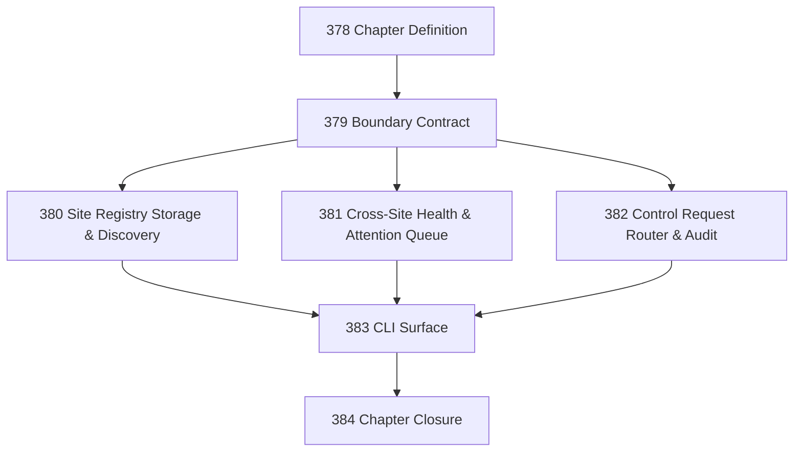

# Operator Console / Site Registry Chapter

## Goal

Create a disciplined operator-facing surface backed by a Site Registry that discovers, inspects, and routes control requests across multiple Narada Sites without becoming hidden authority.

## Substrate Posture

**Substrate-neutral concept, Windows-first implementation.**

The Operator Console and Site Registry are substrate-neutral (discovery, aggregation, routing, audit). The first implementation targets Windows native + WSL Sites. Cloudflare Sites are deferred but the concept must not preclude them.

## DAG

## Active Tasks

| # | Task | Name | Purpose |
|---|------|------|---------|
| 1 | 379 | Operator Console / Site Registry Boundary Contract | Authority, invariant, and no-hidden-authority contract |
| 2 | 380 | Site Registry Storage & Discovery | Filesystem scanning, registry schema, metadata persistence |
| 3 | 381 | Cross-Site Health Aggregation & Attention Queue | Aggregate health, attention queue derivation, notification routing |
| 4 | 382 | Safe Control Request Routing & Audit | Router implementation, audit logging, Site-owned endpoint delegation |
| 5 | 383 | CLI Surface | `narada sites`, `narada console` commands; optional local UI scope |
| 6 | 384 | Chapter Closure | Semantic drift check, gap table, CCC posture, next-work recommendations |

## Chapter Rules

- The console is an operator surface, not an Aim, Site, Vertical, Cycle, or control plane.
- The Site Registry owns inventory and routing only. No direct Site-state mutation.
- Observation paths are read-only. Control paths route through Site-owned APIs with audit.
- The registry is advisory and caching. Deleting it must not affect any Site.
- Use the hardened vocabulary from SEMANTICS.md §2.14. No `operation` smear.
- Windows native and WSL are distinct substrate variants.
- No generic Site abstraction unless Tasks 379–383 prove enough commonality.
- Do not create derivative task-status files.

## Task Files

| # | Task | File | Status |
|---|------|------|--------|
| 378 | Chapter Definition | [`20260421-378-operator-console-site-registry-chapter.md`](20260421-378-operator-console-site-registry-chapter.md) | Closed |
| 379 | Boundary Contract | [`20260421-379-operator-console-boundary-contract.md`](20260421-379-operator-console-boundary-contract.md) | Closed |
| 380 | Site Registry Storage & Discovery | [`20260421-380-site-registry-storage-discovery.md`](20260421-380-site-registry-storage-discovery.md) | Closed |
| 381 | Cross-Site Health & Attention Queue | [`20260421-381-cross-site-health-attention-queue.md`](20260421-381-cross-site-health-attention-queue.md) | Closed |
| 382 | Control Request Router & Audit | [`20260421-382-control-request-router-audit.md`](20260421-382-control-request-router-audit.md) | Closed |
| 383 | CLI Surface | [`20260421-383-operator-console-cli-surface.md`](20260421-383-operator-console-cli-surface.md) | Closed |
| 384 | Chapter Closure | [`20260421-384-operator-console-site-registry-closure.md`](20260421-384-operator-console-site-registry-closure.md) | Closed |

## Closure Criteria

- [x] Task 379 closed: boundary contract exists, authority boundaries explicit, no-hidden-authority invariants stated.
- [x] Task 380 closed: registry schema exists, discovery works for Windows native and WSL, metadata persists.
- [x] Task 381 closed: health aggregation works, attention queue derives correctly, notification routing respects per-channel cooldown.
- [x] Task 382 closed: router forwards requests to Site control APIs, audit log records every routed request, no direct Site mutation.
- [x] Task 383 closed: CLI commands `narada sites` and `narada console` exist and are documented.
- [x] Task 384 closed: semantic drift check passes, gap table produced, CCC posture recorded, next-work recommendations explicit.

## Execution Notes

Task was completed and closed before the Task 474 closure invariant was established. Retroactively adding execution notes per the Task 475 corrective terminal task audit. Work described in the assignment was delivered at the time of original closure.

## Verification

Verified retroactively per Task 475 corrective audit. Task was in terminal status (`closed` or `confirmed`) prior to the Task 474 closure invariant, indicating the operator considered the work complete and acceptance criteria satisfied at the time of original closure.
