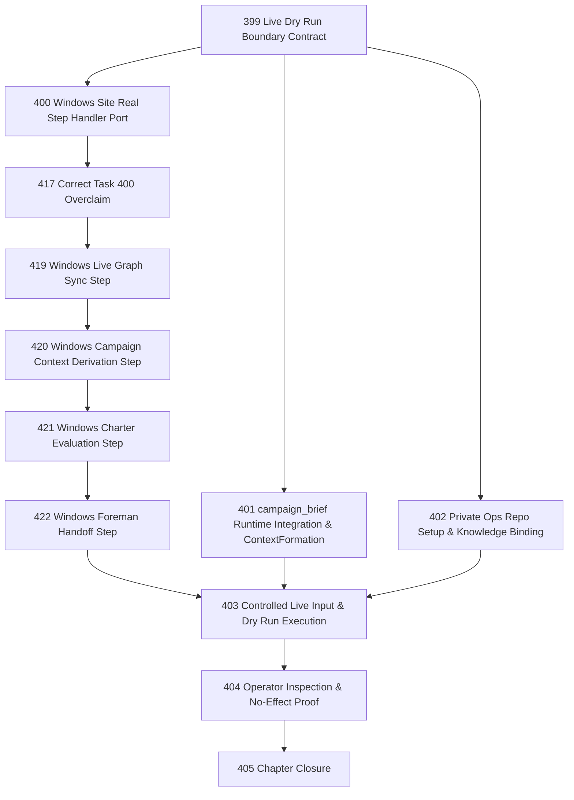

# Email Marketing Live Dry Run Chapter

## Goal

Drive Narada from fixture-backed email-marketing proof to one supervised live dry run.

> A real inbound campaign request from a configured mailbox/source produces a governed campaign brief or missing-info attention item, with no Klaviyo mutation and no campaign send/publish.

## Context

Tasks 387–394 proved the email-marketing Operation structurally and by fixture. The integration test at `packages/sites/windows/test/integration/email-marketing-operation.test.ts` exercises real SQLite stores but simulates steps 2–5 with direct SQL inserts.

This chapter makes the Operation work with real mail, real step handlers, and real operator inspection.

## DAG

## Active Tasks

| # | Task | Name | Purpose |
|---|------|------|---------|
| 1 | 399 | Live Dry Run Boundary Contract | Exact boundary, input selection, success criteria, public/private artifact split |
| 2 | 400 | Windows Site Real Step Handler Port | Port sync, derive, evaluate, handoff from Cloudflare to Windows |
| 2a | 417 | Correct Task 400 Windows Live-Step Overclaim | Classify fixture/live seams and block Task 403 honestly |
| 2b | 419 | Windows Live Graph Sync Step | Replace fixture sync with bounded live source read |
| 2c | 420 | Windows Campaign Context Derivation Step | Replace fixture derivation with campaign context formation |
| 2d | 421 | Windows Charter Evaluation Step | Replace fixture evaluator with real-envelope dry-run evaluation |
| 2e | 422 | Windows Foreman Handoff Step | Replace hardcoded handoff with foreman governance |
| 3 | 401 | campaign_brief Runtime Integration & ContextFormation | Add action type to enums; implement context materializer |
| 4 | 402 | Private Ops Repo Setup & Knowledge Binding | Create private repo structure, config, knowledge sources |
| 5 | 403 | Controlled Live Input & Dry Run Execution | Select one thread, bind real source, execute one Cycle |
| 6 | 404 | Operator Inspection & No-Effect Proof | Inspect output, prove no Klaviyo mutation, document findings |
| 7 | 405 | Chapter Closure | Review, residuals, CCC posture, next-work recommendations |

## Chapter Rules

- Use SEMANTICS.md §2.14 vocabulary: Aim / Site / Cycle / Act / Trace.
- Use Task 397 session/attachment vocabulary where relevant; do not invent a second model.
- No Klaviyo mutation, publish, or send in any dry-run task.
- Private brand/customer data belongs in ops repos, not public Narada packages.
- Live input is bounded: one mailbox, one thread, allowed sender only.
- All campaign drafts require operator review; no auto-approval.
- Do not create derivative task-status files.

## Deferred Capabilities

| Deferred Capability | Rationale |
|---------------------|-----------|
| **Klaviyo API adapter implementation** | v1 work. Dry run proves intent boundary without executing it. |
| **Real Klaviyo campaign create from brief** | Requires adapter + credentials + reconciliation. v1. |
| **Campaign send/publish** | Forbidden in all versions without explicit policy amendment. |
| **NLP/ML extraction** | v0 uses simple keyword matching. NLP deferred to v1. |
| **Campaign analytics observation** | Reading campaign metrics back as facts is post-v1. |
| **Cloudflare Site marketing Operation** | Cloudflare Sites deferred across all verticals. |
| **Multi-mailbox / multi-Site marketing** | One Site, one mailbox for v0 dry run. |
| **Agent roster → Site attachment integration** | Task 397 defines vocabulary; integration is future work. |

## Closure Criteria

- [ ] Task 399 closed: boundary contract defines exact dry-run scope, input constraints, and success criteria.
- [ ] Task 417 closed: Task 400 overclaim is classified and Task 403 blockers are explicit.
- [ ] Tasks 419–422 closed: Windows Site runs real sync, derive, evaluate, and handoff step handlers (not fixture stubs).
- [ ] Task 401 closed: `campaign_brief` is a first-class action type in runtime enums; `CampaignRequestContextFormation` processes real mail facts.
- [ ] Task 402 closed: private ops repo exists with Site config, knowledge sources, and credential binding.
- [ ] Task 403 closed: one controlled live input was processed by a real Cycle on Windows.
- [ ] Task 404 closed: operator inspected the result; no Klaviyo mutation occurred; findings documented.
- [ ] Task 405 closed: semantic drift check passes, gap table produced, CCC posture recorded.
