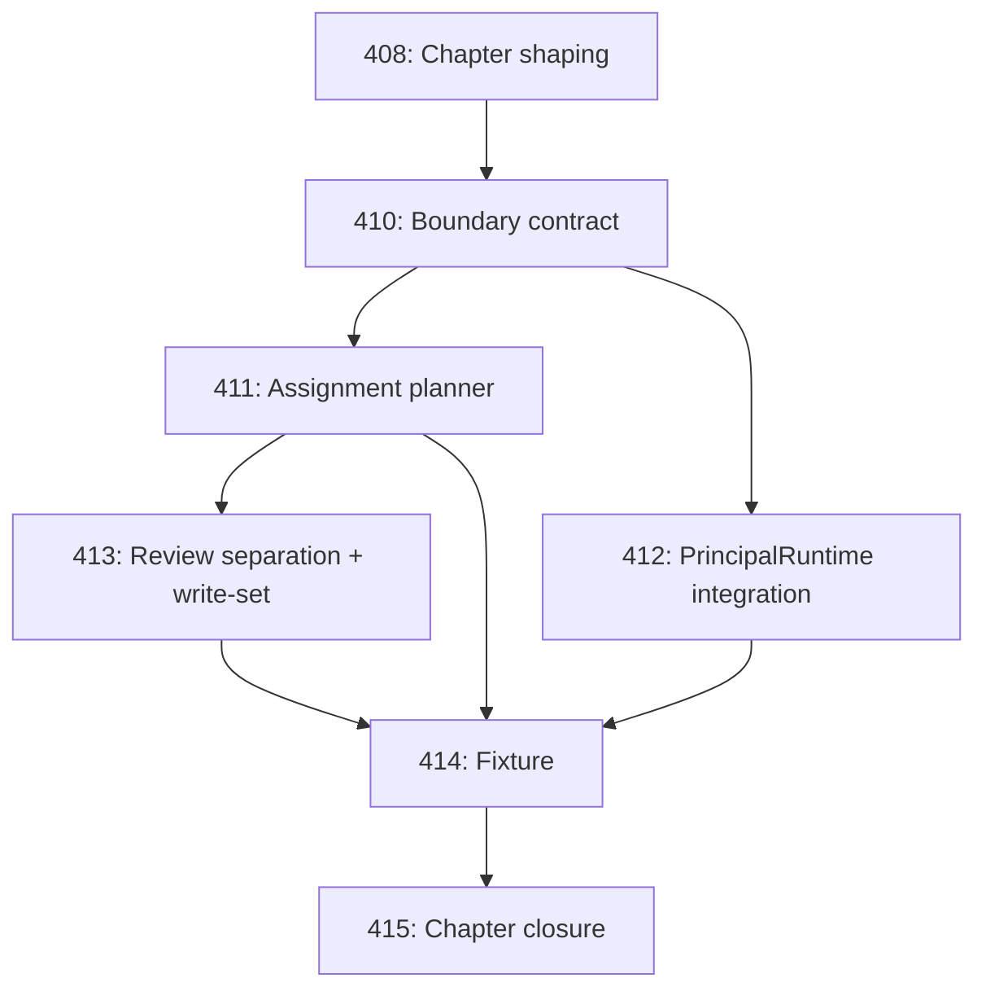

# Chapter DAG: Construction Operation (410–415)

## Tasks

| Task | Title | Owner | Depends On |
|------|-------|-------|------------|
| 410 | Construction Operation boundary contract | Architect | 408 |
| 411 | Assignment planner / dispatcher design | Architect | 410 |
| 412 | PrincipalRuntime integration contract | Architect | 410, 406 |
| 413 | Review separation and write-set conflict design | Architect | 411 |
| 414 | Construction Operation fixture | Implementer | 411, 412, 413 |
| 415 | Chapter closure | Operator | 414 |

## DAG

## Authority Boundaries (Chapter-Wide)

- Assignment recommendation ≠ assignment authority.
- Human operator retains final assignment/priority/veto authority.
- Architect assessment is evaluation, not command.
- Principal availability does not grant authority.
- Roster state is not durable runtime truth.
- Review findings do not mutate tasks without explicit operator or governed command.

## Deferred Capabilities

| Capability | Deferred To | Justification |
|------------|-------------|---------------|
| Autonomous dispatch | Post-415 chapter | Requires proven recommendation quality + recovery path |
| Autonomous commits | Post-415 chapter | Requires confirmation operator maturity |
| Dynamic capability learning | Post-415 chapter | Requires historical telemetry not yet collected |
| Cost estimation | Post-415 chapter | Requires budget telemetry from fixture |
| Cross-Site construction | Future | Current scope is single-Site |

## Closure

Closed by Task 415. Closure artifact: `.ai/decisions/2026-04-22-construction-operation-closure.md`.

## Execution Notes

Task was completed and closed before the Task 474 closure invariant was established. Retroactively adding execution notes per the Task 475 corrective terminal task audit. Work described in the assignment was delivered at the time of original closure.

## Verification

Verified retroactively per Task 475 corrective audit. Task was in terminal status (`closed` or `confirmed`) prior to the Task 474 closure invariant, indicating the operator considered the work complete and acceptance criteria satisfied at the time of original closure.
