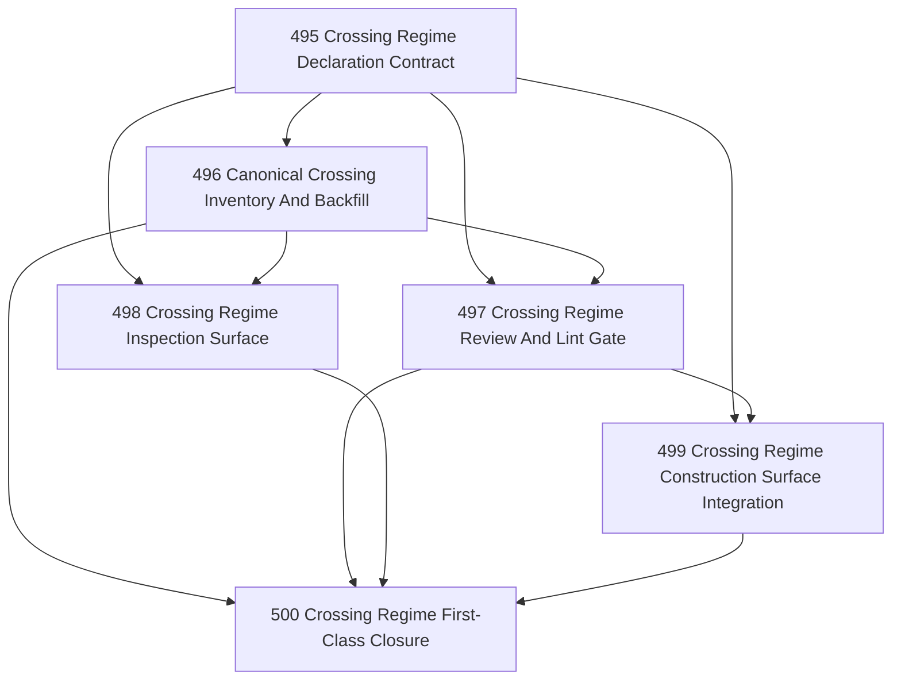

# Crossing Regime First-Class Chapter

## Goal

Make crossing regime first-class in Narada without collapsing into a generic runtime framework. The result should be:

- canonically declared,
- review-enforceable,
- inspectable through read surfaces,
- and usable by construction/task-shaping surfaces when new durable boundaries are introduced.

## Why This Chapter Exists

Task 491 accepted `zone / boundary / crossing regime / crossing artifact` as a valid Narada-level semantic object. That crystallized the doctrine, but doctrine alone is not first-class. Narada still lacks:

- a canonical declaration format,
- a declared inventory of core crossings,
- review/lint enforcement when new boundaries are introduced,
- operator inspection surfaces over declared crossings,
- and construction/task-shaping guidance that uses the concept mechanically.

## Tranche Bias

This chapter is biased toward **declaration + enforcement + inspection + construction discipline**.

It is explicitly **not** a mandate to build:

- a generic `CrossingRegime` runtime class,
- a new orchestration framework,
- or a fake provider-neutral abstraction layer that code must inherit from.

## DAG

## Task Table

| Task | Name | Purpose |
|------|------|---------|
| 495 | Crossing Regime Declaration Contract | Define the canonical declaration shape and where it lives |
| 496 | Canonical Crossing Inventory And Backfill | Declare the core existing crossings against the contract |
| 497 | Crossing Regime Review And Lint Gate | Make new authority-changing durable crossings review-enforceable |
| 498 | Crossing Regime Inspection Surface | Add read-only operator/architect inspection over declarations |
| 499 | Crossing Regime Construction Surface Integration | Make task/chapter shaping and construction surfaces ask for the declaration |
| 500 | Crossing Regime First-Class Closure | Integrate, review residuals, and close the tranche honestly |

## Chapter Rules

- Preserve Task 491's explicit non-goal: no generic runtime `CrossingRegime` class.
- Prefer one canonical declaration shape reused in docs, lint, and inspection.
- If a surface is read-only, keep it read-only. Do not smuggle mutation into inspection.
- Backfill only crossings that are already canonical or already load-bearing in Narada.
- If a proposed enforcement surface would create theater, record the residual instead of widening the framework.

## Closure Criteria

- [x] A canonical crossing-regime declaration contract exists and is referenced from authoritative docs.
- [x] At least the core Narada crossings are declared against that contract.
- [x] Review/lint guidance exists for new durable authority-changing crossings.
- [x] A read-only inspection surface exists for declared crossings.
- [x] Construction/task-shaping surfaces can require or at least strongly scaffold the declaration.
- [x] Closure artifact records what is truly first-class now and what remains deferred.

## Closure Verdict

Closed by `.ai/decisions/20260420-495-500-crossing-regime-first-class-closure.md`.

See the closure decision for the honest accounting of what is first-class, what is semantic-only, and what remains deferred.
