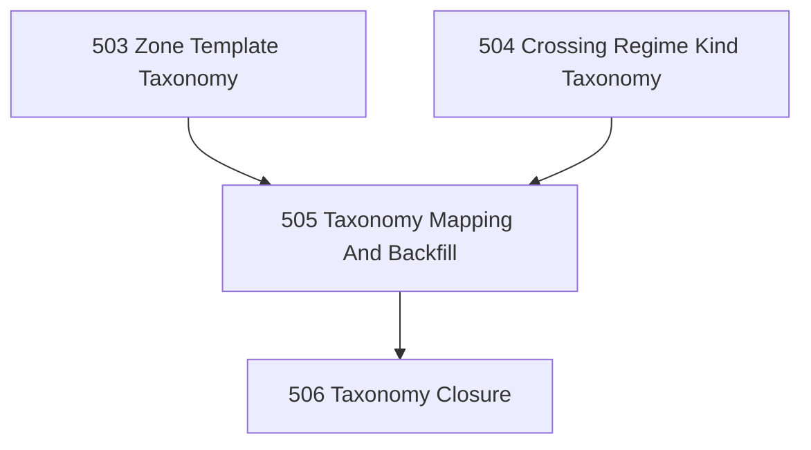

# Zone Template And Regime-Kind Taxonomy Chapter

## Goal

Stabilize the next doctrinal layer above crossing-regime declarations:

- define reusable `zone_template` taxonomy,
- define reusable `crossing_regime_kind` taxonomy,
- back-map Narada's current topology to those taxonomies,
- and close the chapter honestly without overclaiming runtime generativity.

## Why This Chapter Exists

The crossing-regime tranche made Narada's topology first-class at the level of declaration, inspection, review, and construction surfaces.

What remains open is whether Narada's zones and regimes can be described by a small set of reusable kinds:

- not just `zone`,
- but `zone_template`
- not just `crossing_regime`,
- but `crossing_regime_kind`

This chapter handles the taxonomic layer only.

## Explicit Deferral

This chapter does **not** attempt:

- generic runtime derivation from zone/regime declarations,
- provenance-safe-by-construction for every artifact path,
- or a broad runtime refactor around taxonomy objects.

Those questions are deferred until the taxonomies are pressure-tested and shown to compress the doctrine rather than merely rename it.

## DAG

## Task Table

| Task | Name | Purpose |
|------|------|---------|
| 503 | Zone Template Taxonomy | Define reusable zone-template kinds without freezing accidental doctrine into runtime machinery |
| 504 | Crossing Regime Kind Taxonomy | Define reusable regime-kind taxonomy as edge-law kinds rather than generic runtime classes |
| 505 | Taxonomy Mapping And Backfill | Map current Narada zones/crossings to the new taxonomies and record residual mismatches |
| 506 | Taxonomy Closure | Decide what the taxonomy now explains, what remains descriptive only, and what is explicitly deferred |

## Chapter Rules

- Keep the graph/topology reading primary.
- Do not collapse taxonomy into runtime implementation.
- Prefer a small stable taxonomy over a large decorative taxonomy.
- Reject taxonomy entries that do not reduce ambiguity or increase explanatory power.
- Record residual ambiguity honestly instead of forcing every current object into a crisp type.

## Closure Criteria

- [x] A bounded `zone_template` taxonomy exists.
- [x] A bounded `crossing_regime_kind` taxonomy exists.
- [x] Current Narada crossings/zones are mapped or explicitly marked as ambiguous/deferred.
- [x] Closure states clearly why runtime derivation and provenance-by-construction remain deferred.

## Closure Artifact

`.ai/decisions/20260423-506-taxonomy-chapter-closure.md` — states what the taxonomies explain, what remains descriptive only, and why runtime derivation and provenance-by-construction are deferred.
