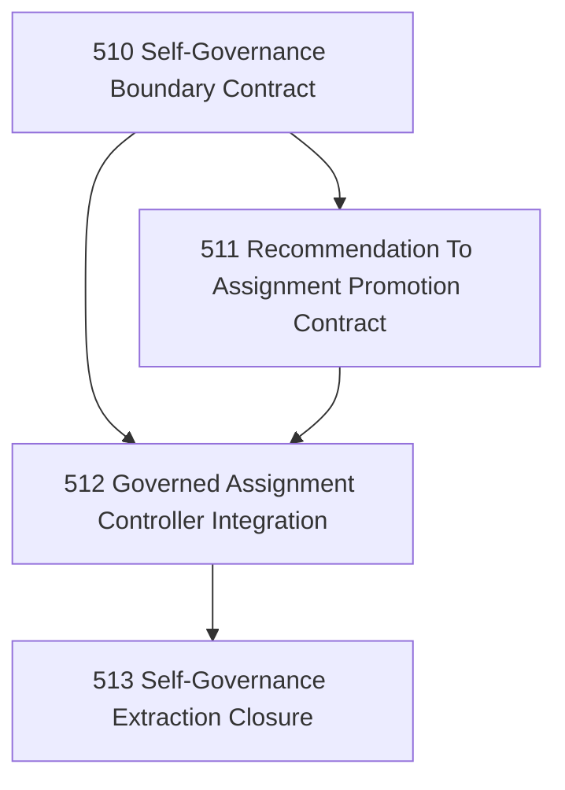

# Self-Governance Extraction Chapter

## Goal

Reduce hidden human scheduling by extracting more of Narada's own task-governance and recommendation flow into explicit, governed operators.

## Why This Chapter Exists

Narada can recommend, assign, review, close, and observe work, but the operator still acts as the hidden scheduler more often than Narada itself. This chapter closes that gap without collapsing into unsafe autonomy.

## DAG

## Task Table

| Task | Name | Purpose |
|------|------|---------|
| 510 | Self-Governance Boundary Contract | Define exactly what Narada may govern in its own build loop and what remains operator-owned |
| 511 | Recommendation To Assignment Promotion Contract | Formalize the governed path from recommendation to assignment/promotion |
| 512 | Governed Assignment Controller Integration | Integrate the bounded promotion path into actual task-governance surfaces |
| 513 | Self-Governance Extraction Closure | Close the chapter honestly, including residual operator-owned decisions |

