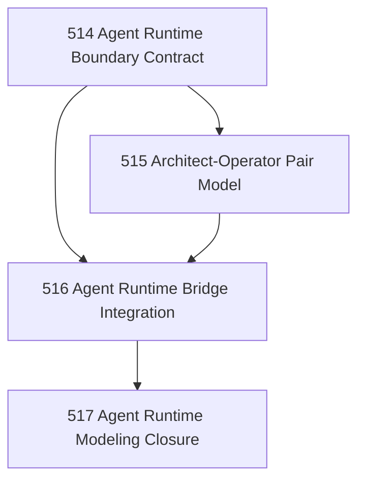

# Agent Runtime First-Class Modeling Chapter

## Goal

Make the architect-operator + agent swarm pattern legible as a first-class Narada runtime rather than an external improvisation.

## Why This Chapter Exists

Narada is still partially built by a runtime architecture it does not fully model. This chapter defines and integrates the agent/runtime model without collapsing roles or authority boundaries.

## DAG

## Task Table

| Task | Name | Purpose |
|------|------|---------|
| 514 | Agent Runtime Boundary Contract | Define what an agent runtime is in Narada terms |
| 515 | Architect-Operator Pair Model | Model the governing pair relation without collapsing roles |
| 516 | Agent Runtime Bridge Integration | Bridge the modeled runtime into task/principal surfaces |
| 517 | Agent Runtime Modeling Closure | Close the chapter and state remaining unmapped behavior |

