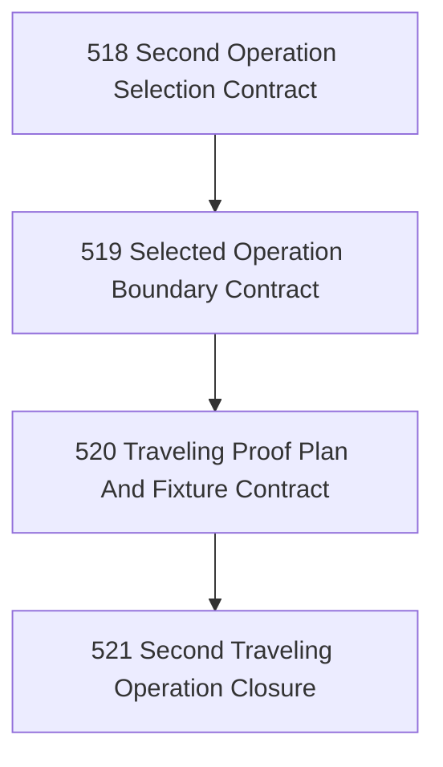

# Second Traveling Operation Selection And Proof Chapter

## Goal

Select one second real operation family beyond mailbox/email-marketing and shape the first bounded proof that Narada's topology travels.

## Why This Chapter Exists

Narada needs one more real operation, not another abstract argument, to prove that the governed zone/crossing topology is portable beyond the current mailbox-heavy line.

## Parallel Input

The email-marketing live-proof line (`399–405`) remains active and should inform this chapter, but it is not a hard dependency. Task 403 is explicitly operator-gated; that supervised execution must not freeze the selection and shaping of the second traveling operation.

## DAG

## Task Table

| Task | Name | Purpose | Status |
|------|------|---------|--------|
| 518 | Second Operation Selection Contract | Choose the next operation family by explicit criteria, not whim | Closed |
| 519 | Selected Operation Boundary Contract | Define facts, work, intents, and forbidden shortcuts for the chosen operation | Closed |
| 520 | Traveling Proof Plan And Fixture Contract | Define the first bounded proof and its fixtures/live boundary | Closed |
| 521 | Second Traveling Operation Closure | Close the chapter shaping and state what proof comes next | Closed |

## Chapter Closure

**Closed by:** a2  
**Closed at:** 2026-04-23  
**Closure artifact:** `.ai/decisions/20260423-521-second-traveling-operation-closure.md`

**Selected operation:** Timer → Process ("Scheduled Site Health Check and Maintenance Reporting")  
**Core finding:** The Timer → Process operation travels through the existing kernel without any code modifications, proving Narada's topology is vertical-agnostic.  
**Next executable proof line:** Live-backed Timer → Process proof (charter prompt authoring, CLI template, supervised live exercise).
