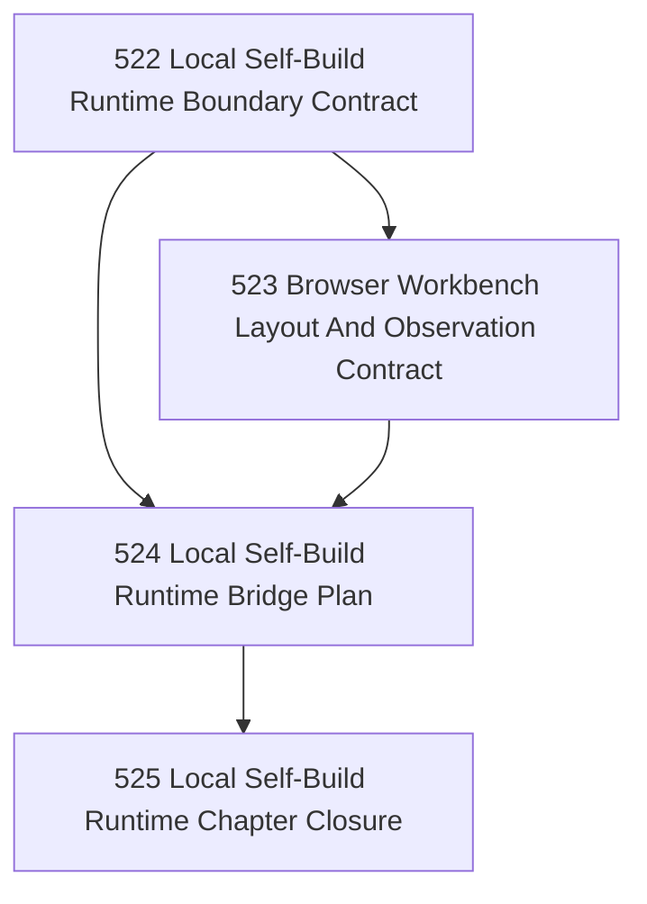

# Local Self-Build Runtime And Workbench Chapter

## Goal

Replace the human/chat relay layer in Narada development with a bounded local runtime and browser workbench backed by Narada's own governed state.

## Why This Chapter Exists

Narada now has:

- self-governance shaping (`510–513`),
- agent-runtime modeling (`514–517`),
- and a clearer picture of what remains implementation rather than doctrine.

But the actual Narada build loop still depends on the operator and chat transcript to:

- carry assignments,
- reconcile agent state,
- surface blockers,
- and observe the swarm as a coherent whole.

This chapter defines the first bounded local runtime that can host that loop directly, with a browser workbench as the canonical operator surface.

## Canonical v0 Workbench Layout

The initial browser workbench should model the current real operating posture:

- row 1: `a1`, `a2`, `architect` spanning columns 3–4
- row 2: `a3`, `a4`, `a5`, `a6`

This is not a terminal clone. It is the first bounded operator surface over governed local runtime state.

## DAG

## Task Table

| Task | Name | Purpose | Status |
|------|------|---------|--------|
| 522 | Local Self-Build Runtime Boundary Contract | Define the bounded local runtime, its principals, governed actions, and explicit non-goals | Closed |
| 523 | Browser Workbench Layout And Observation Contract | Specify the browser operator surface, including the canonical 2x4 agent/architect layout | Closed |
| 524 | Local Self-Build Runtime Bridge Plan | Define how Codex/chat agents, task governance, and browser controls bridge into the runtime without hidden transport | Closed |
| 525 | Local Self-Build Runtime Chapter Closure | Close the chapter honestly and state the first executable implementation line | Closed |

## Chapter Closure

**Closed by:** a2  
**Closed at:** 2026-04-23  
**Closure artifact:** `.ai/decisions/20260423-525-local-self-build-runtime-chapter-closure.md`

**Core finding:** The local self-build runtime is a **composition layer over existing operators and stores**, not a new authority boundary. The workbench is an **observation and control surface**, not a runtime host. Chat is **explicitly demoted** from authoritative transport.

**Boundedness proof:**
- Zero new durable stores invented
- Zero new authority classes invented
- Zero new CLI operators invented
- Zero new data sources for workbench invented

**Next executable implementation line:** Workbench v0 Build — HTTP API adapter (~150 lines), static workbench page (~500 lines), control wiring (~100 lines), fixture-backed verification.
