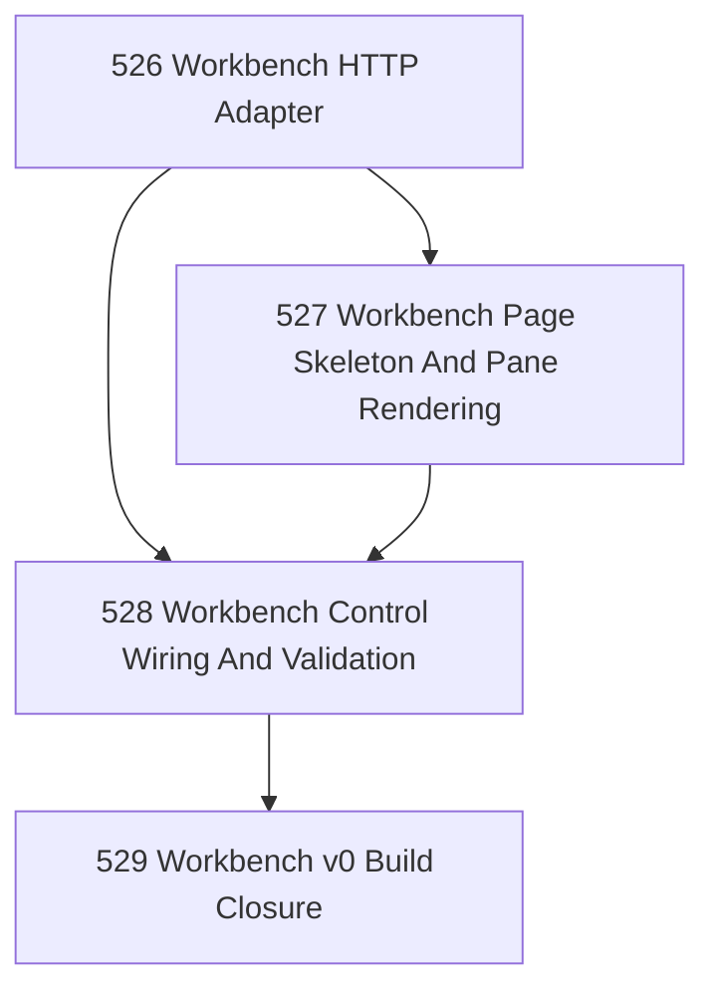

# Workbench v0 Build Chapter

## Goal

Implement the first local browser workbench for Narada self-build: a localhost HTTP adapter, static workbench page, bounded control wiring, and focused verification.

## Why This Chapter Exists

Tasks 522–525 defined the bounded local self-build runtime, the canonical 2×4 browser workbench layout, and the bridge plan that demotes chat from authoritative transport. This chapter turns that bounded design into executable local machinery.

## Canonical Scope

Workbench v0 should include only:

- thin localhost HTTP adapter over existing governed operators,
- static browser page with the canonical layout,
- read surfaces grounded in existing stores,
- bounded control wiring through existing mutation operators,
- focused fixture-backed verification.

## DAG

## Task Table

| Task | Name | Purpose |
|------|------|---------|
| 526 | Workbench HTTP Adapter | Implement localhost GET/POST adapter over existing CLI/runtime read and mutation surfaces |
| 527 | Workbench Page Skeleton And Pane Rendering | Build the static browser page with canonical 2×4 layout and pane read-model rendering |
| 528 | Workbench Control Wiring And Validation | Wire bounded controls through governed operators and validate request/response behavior |
| 529 | Workbench v0 Build Closure | Close the implementation chapter honestly and state what remains for a usable daily surface |

