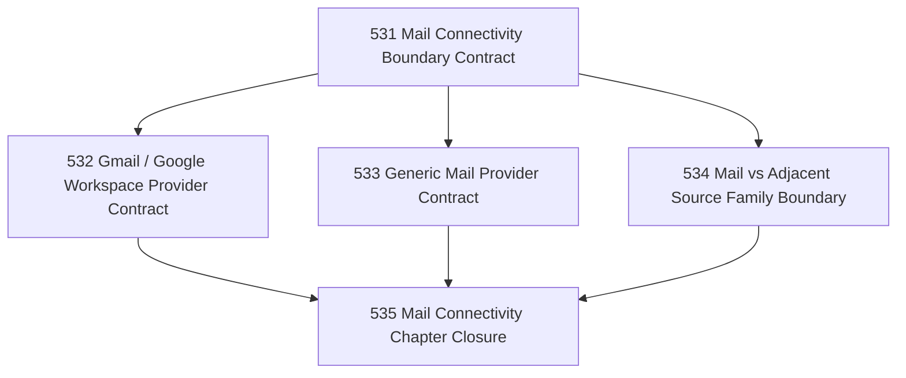

# Mail Connectivity Generalization And Provider Boundary Chapter

## Goal

Generalize Narada's mail-connectivity boundary beyond Microsoft Graph so the mail vertical can travel across the bulk of real-world provider environments without collapsing adjacent source families into "email."

## Why This Chapter Exists

Narada's first mail connectivity path is Microsoft Graph / Exchange. That is a strong initial vertical, but it is not the whole mail world. Narada needs an explicit mail-connectivity family that can host:

- Microsoft Graph / Exchange,
- Gmail / Google Workspace,
- generic IMAP / SMTP style providers,

while preserving the distinction that systems like GitHub are **not** mail transports and should be modeled as adjacent source / notification families rather than squeezed into the mail boundary.

## Parallel Shape

After the boundary contract, the provider-specific and anti-smear tasks may run in parallel.

## DAG

## Task Table

| Task | Name | Purpose |
|------|------|---------|
| 531 | Mail Connectivity Boundary Contract | Define the canonical provider-agnostic mail boundary and what remains provider-specific |
| 532 | Gmail / Google Workspace Provider Contract | Specify how Gmail-class providers fit the canonical mail boundary |
| 533 | Generic Mail Provider Contract | Specify how generic IMAP / SMTP style providers fit the canonical mail boundary |
| 534 | Mail vs Adjacent Source Family Boundary | Prevent GitHub / notification-source smear into mail connectivity |
| 535 | Mail Connectivity Chapter Closure | Close the chapter honestly and name the next executable line |

