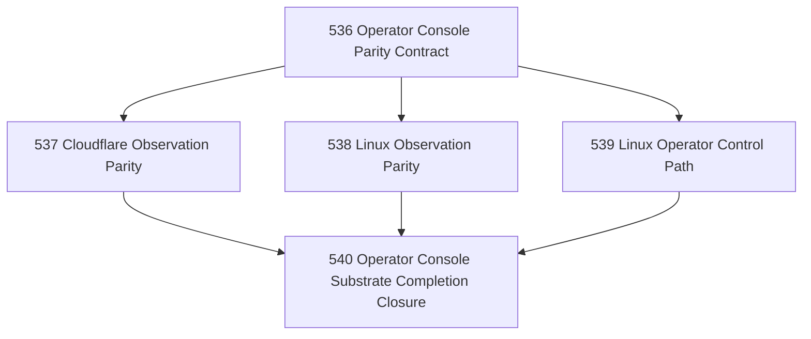

# Operator Console Substrate Completion Chapter

## Goal

Make the existing Operator Console layer fully meaningful across the currently supported substrates, with special focus on Cloudflare and Linux parity.

## Why This Chapter Exists

Narada already has:

- a generic CLI Operator Console,
- an HTTP/browser console server,
- substrate adapters for Windows, Cloudflare, and Linux.

But substrate parity is incomplete:

- Windows is strongest.
- Cloudflare has health and control, but shallow observation.
- Linux has read surfaces, but no real operator control path.

This chapter completes the **existing** console layer rather than inventing a new one.

## Parallel Shape

After the parity contract, Cloudflare and Linux work can proceed in parallel.

## DAG

## Task Table

| Task | Name | Status | Purpose |
|------|------|--------|---------|
| 536 | Operator Console Parity Contract | ✅ Closed | Define the exact cross-substrate console parity target and what "fully meaningful" means |
| 537 | Cloudflare Observation Parity | ✅ Closed | Fill the missing Cloudflare observation surfaces needed by the console |
| 538 | Linux Observation Parity | ✅ Closed | Fill the missing Linux observation surfaces needed by the console |
| 539 | Linux Operator Control Path | ✅ Closed | Implement the bounded Linux control path through canonical operator actions |
| 540 | Operator Console Substrate Completion Closure | ✅ Closed | Close the chapter honestly and state remaining parity limits |

## Closure

Chapter closed 2026-04-23. See `.ai/decisions/20260423-540-operator-console-substrate-completion-closure.md` for final capability matrix, residual limits, and next pressures.

