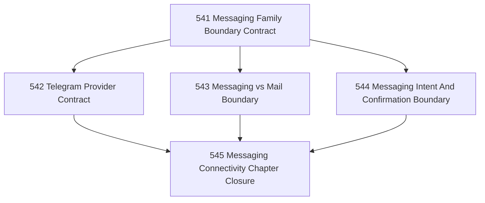

# Messaging Connectivity Family Boundary Chapter

## Goal

Define a messaging-connectivity family parallel to mail connectivity, with Telegram as the first concrete provider contract.

## Why This Chapter Exists

Some user-facing systems arrive as conversational streams rather than mailbox correspondence. Telegram is the first strong candidate. Narada needs to model this as a distinct connectivity family rather than smearing it into mail.

## Parallel Shape

After the family boundary contract, Telegram-specific and anti-smear tasks can run in parallel.

## DAG

## Task Table

| Task | Name | Purpose |
|------|------|---------|
| 541 | Messaging Family Boundary Contract | Define the canonical provider-agnostic messaging boundary distinct from mail |
| 542 | Telegram Provider Contract | Specify how Telegram fits that messaging boundary |
| 543 | Messaging vs Mail Boundary | Prevent semantic smear between messaging and mail connectivity |
| 544 | Messaging Intent And Confirmation Boundary | Define outbound/intent/reconciliation semantics for messaging-family providers |
| 545 | Messaging Connectivity Chapter Closure | Close the chapter honestly and name the next executable provider line |

