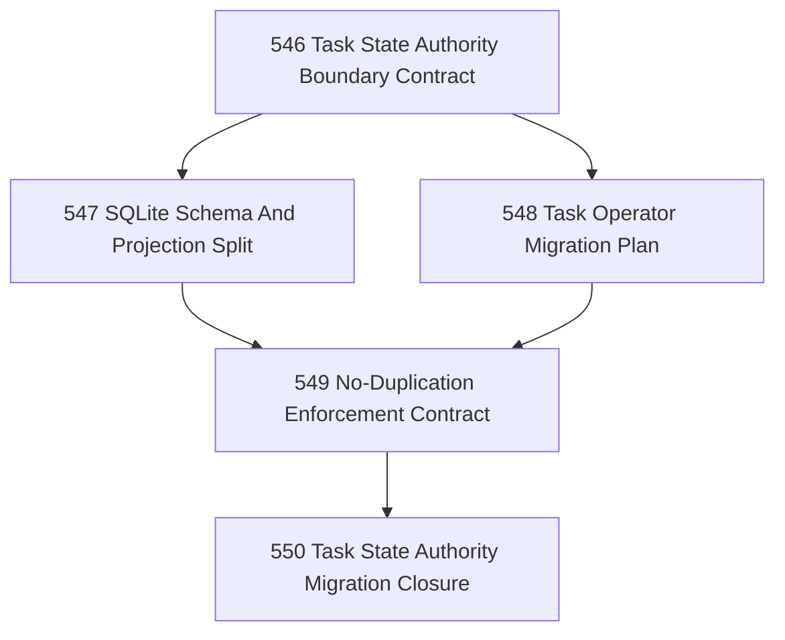

# Task Lifecycle State Authority Migration Chapter

## Goal

Move task lifecycle authority from raw markdown mutation into governed SQLite state, while preventing duplication between SQLite and markdown representations.

## Why This Chapter Exists

Narada repeatedly catches the same failure mode:

- agents complete substantive work,
- then mutate task markdown directly into terminal state,
- bypassing governed lifecycle operators.

The principled fix is not more reminders. It is to make lifecycle authority live in a governed state store, with markdown reduced to authored task specification and/or compiled readable projection.

## No-Duplication Rule

This chapter must preserve a strict anti-duplication rule:

- SQLite owns authoritative lifecycle state.
- Markdown owns authored task specification.
- Any merged task view is projected/compiled from those sources.
- The same field must not be independently authoritative in both places.

## DAG

## Task Table

| Task | Name | Purpose |
|------|------|---------|
| 546 | Task State Authority Boundary Contract | Define which task fields belong to SQLite authority and which remain markdown-authored |
| 547 | SQLite Schema And Projection Split | Define the lifecycle schema, projection model, and markdown/spec split without duplicating authority |
| 548 | Task Operator Migration Plan | Define how existing claim/review/finish/close/evidence operators migrate to SQLite-backed authority |
| 549 | No-Duplication Enforcement Contract | Define how Narada prevents dual-authority task fields across SQLite and markdown |
| 550 | Task State Authority Migration Closure | Close the chapter honestly and name the first executable migration line |
