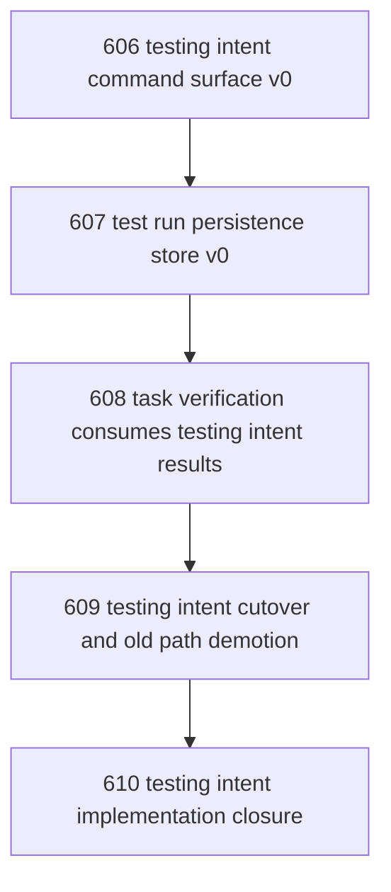

# Testing Intent Zone Implementation And Cutover

## Goal

Implement the first real Testing Intent Zone path so test execution for task verification can travel through a sanctioned request -> execution -> result regime instead of ad hoc shell invocation.

## DAG

## Active Tasks

| # | Task | Name | Purpose |
|---|------|------|---------|
| 1 | 606 | testing intent command surface v0 | Create the sanctioned operator surface for requesting and observing test runs. |
| 2 | 607 | test run persistence store v0 | Persist governed test run records with timing, status, and outcome. |
| 3 | 608 | task verification consumes testing intent results | Make task verification use durable testing results rather than ad hoc shell narratives. |
| 4 | 609 | testing intent cutover and old path demotion | Demote raw shell test execution from canonical task-verification posture. |
| 5 | 610 | testing intent implementation closure | Close the implementation line and record what is now canonical vs still deferred. |

## CCC Posture

| Coordinate | Evidenced State | Projected State If Chapter Verifies | Pressure Path | Evidence Required |
|------------|-----------------|-------------------------------------|---------------|-------------------|
| semantic_resolution | 0 | 1 | Testing request, execution, and result stop collapsing into one ad hoc shell act. | Commands, docs, and result artifacts show distinct stages. |
| invariant_preservation | 0 | 1 | Verification evidence becomes governed and replay-inspectable. | Task evidence and test-run persistence agree. |
| constructive_executability | 0 | 1 | Agents gain a live sanctioned path instead of doctrine only. | End-to-end command path works locally. |
| grounded_universalization | 0 | 1 | The path works for focused verification without assuming one test runner forever. | Request/result contracts do not hard-code one package or suite shape. |
| authority_reviewability | 0 | 1 | Operator can inspect what was requested, run, timed out, and returned. | Persisted records and read surface exist. |
| teleological_pressure | 0 | 1 | Narada moves from "testing should be governed" to "testing is governed." | Old ad hoc posture is explicitly demoted. |

## Deferred Work

| Deferred Capability | Rationale |
|---------------------|-----------|
| Retry and queue policy sophistication | v0 only needs one governed path, not scheduler-grade optimization. |
| Full test matrix orchestration | v0 is for canonical verification runs, not whole-fleet CI planning. |
| Remote/distributed runner routing | v0 may stay local as long as the regime and persistence are real. |

## Closure Criteria

- [ ] All tasks in this chapter are closed or confirmed.
- [ ] A sanctioned test-run request path exists.
- [ ] Durable test-run results are persisted and inspectable.
- [ ] Task verification can consume testing-intent results.
- [ ] Raw shell test execution is explicitly demoted from canonical task verification.
