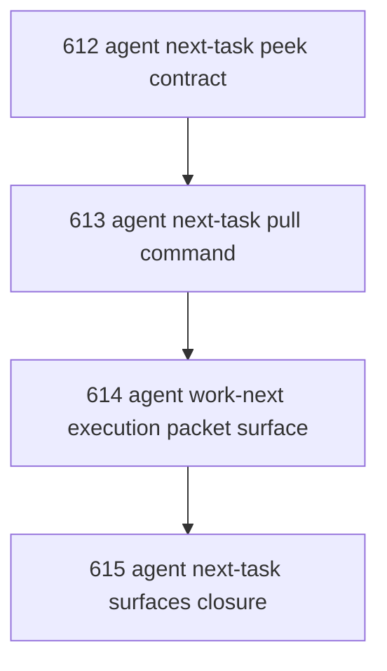

# Agent Next-Task Peek Pull And Work Surfaces

## Goal

Implement a de-arbitrized agent-facing next-task surface family so an agent can inspect available work without mutation, explicitly take the next admissible task, and obtain the exact execution packet without collapsing inspection, claim, and execution into one opaque operator.

## DAG

## Active Tasks

| # | Task | Name | Purpose |
|---|------|------|---------|
| 1 | 612 | agent next-task peek contract | Define the non-mutating inspection surface. |
| 2 | 613 | agent next-task pull command | Implement explicit take/claim of the next admissible task. |
| 3 | 614 | agent work-next execution packet surface | Return the exact execution packet without requiring manual recomposition. |
| 4 | 615 | agent next-task surfaces closure | Close the line and record canonical usage. |

## CCC Posture

| Coordinate | Evidenced State | Projected State If Chapter Verifies | Pressure Path | Evidence Required |
|------------|-----------------|-------------------------------------|---------------|-------------------|
| semantic_resolution | 0 | 1 | Distinguish peek from pull from work packet. | Commands and help reflect distinct semantics. |
| invariant_preservation | 0 | 1 | Inspection does not mutate; pull does not silently execute. | Tests prove boundary behavior. |
| constructive_executability | 0 | 1 | Agents can self-serve next work with less operator relay. | End-to-end commands run locally. |
| grounded_universalization | 0 | 1 | Surface works for agents generally, not one hard-coded worker. | `--agent` posture stays generic. |
| authority_reviewability | 0 | 1 | Operator can inspect what was peeked or pulled. | Durable assignment linkage remains visible. |
| teleological_pressure | 0 | 1 | Narada moves from recommendation-only toward actual agent pickup. | Canonical next-task workflow is documented. |

## Deferred Work

| Deferred Capability | Rationale |
|---------------------|-----------|
| Auto-close after execution | Outside this chapter; would collapse execution and closure too early. |
| Autonomous multi-task loop | v0 needs one-step pickup, not full agent autonomy. |

## Closure Criteria

- [ ] All tasks in this chapter are closed or confirmed.
- [ ] A non-mutating `peek` surface exists.
- [ ] A mutating `pull` surface exists.
- [ ] An execution-packet surface exists or is explicitly combined with `pull` under clear semantics.
- [ ] The chapter records the canonical operator/agent usage pattern.
