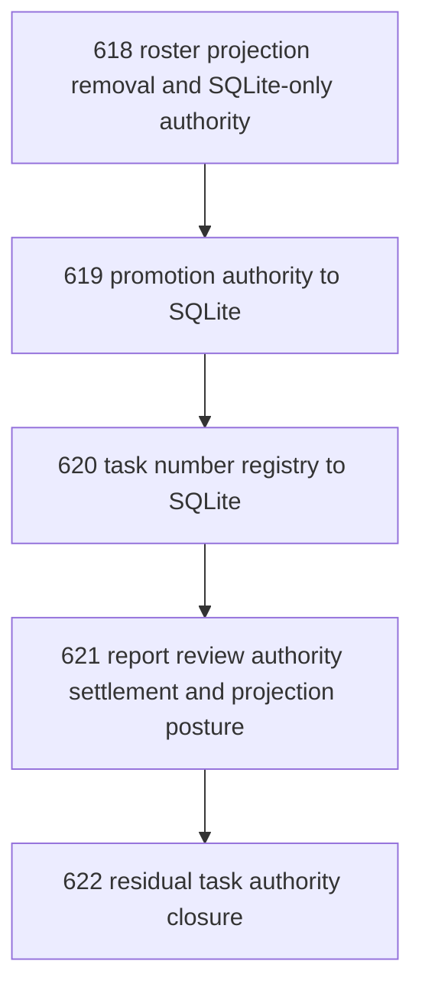

# Residual Task Authority Filesystem Elimination

## Goal

Eliminate the remaining filesystem-backed task authority surfaces so SQLite and sanctioned commands own live task state, while disk artifacts become authored spec, review/decision narrative, or projection only.

## DAG

## Active Tasks

| # | Task | Name | Purpose |
|---|------|------|---------|
| 1 | 618 | roster projection removal and SQLite-only authority | Remove roster.json as a live authority surface. |
| 2 | 619 | promotion authority to SQLite | Move recommendation-promotion authority off file-backed artifacts. |
| 3 | 620 | task number registry to SQLite | Remove `.registry.json` as the live numbering authority. |
| 4 | 621 | report review authority settlement and projection posture | Decide and implement which task narrative artifacts stay on disk and which are SQLite authority. |
| 5 | 622 | residual task authority closure | Record the post-cutover authoritative split and what remains deferred. |

## CCC Posture

| Coordinate | Evidenced State | Projected State If Chapter Verifies | Pressure Path | Evidence Required |
|------------|-----------------|-------------------------------------|---------------|-------------------|
| semantic_resolution | 0 | 1 | File artifacts stop pretending to be live task state. | Commands and stores show one authority per field. |
| invariant_preservation | 0 | 1 | Task state no longer drifts across SQLite, JSON, and markdown. | Focused migration tests and command checks pass. |
| constructive_executability | 0 | 1 | Operators and agents use commands instead of raw substrate handling. | CLI surfaces stay live after each cutover. |
| grounded_universalization | 0 | 1 | The authority split stays readable and portable across future Sites. | Disk artifacts remain human-legible without being hidden state. |
| authority_reviewability | 0 | 1 | What is authoritative vs projected is inspectable instead of implied. | Closure artifact records the final split. |
| teleological_pressure | 0 | 1 | Narada moves from “mixed migration” to “single live task authority spine.” | Residual file-era authority surfaces are explicitly removed or demoted. |

## Deferred Work

| Deferred Capability | Rationale |
|---------------------|-----------|
| Full markdown-spec elimination | Authored task spec may still remain on disk after live state authority is removed. |
| Decision artifact elimination | Long-form closure/architecture narrative may intentionally remain file-based. |

## Closure Criteria

- [ ] All tasks in this chapter are closed or confirmed.
- [ ] Roster is no longer live-authoritative on JSON.
- [ ] Promotion authority is no longer live-authoritative on JSON.
- [ ] Task number allocation is no longer live-authoritative on `.registry.json`.
- [ ] Report/review/decision artifacts have an explicit authority vs projection split.
