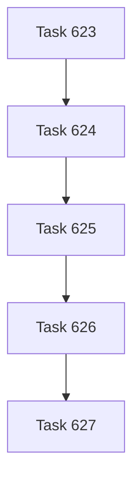

# Task 623-627 - Task Spec Authority To SQLite And Markdown Projection Cutover

## Chapter Goal

Complete the final task-authority cutover by moving authored task specification into SQLite and demoting markdown task files to projection or export only.

## Task DAG

| Task | Title | Purpose |
|------|-------|---------|
| **623** | Task Spec Authority Boundary Contract | Fix the final authority split: SQLite owns spec, markdown is no longer source |
| **624** | Task Spec Command Surface And Storage Model | Define the sanctioned create/read/amend model for SQLite-owned task spec |
| **625** | Task Read And Amend From SQLite Projection | Move read/amend command surfaces to SQLite-backed spec and projection |
| **626** | Markdown Task Projection Export And Cutover | Demote markdown files to projection/export only and remove normal direct-source assumptions |
| **627** | Task Spec SQLite Authority Closure | Verify the cutover and close the line |

## Chapter Closure Criteria

- [ ] Task spec authority is no longer split between markdown and SQLite.
- [ ] Normal task read and amend surfaces use SQLite-owned spec.
- [ ] Markdown task files are projection/export only.
- [ ] Direct markdown task editing is no longer part of the normal task workflow.
- [ ] Verification or bounded blocker evidence is recorded for the cutover.
