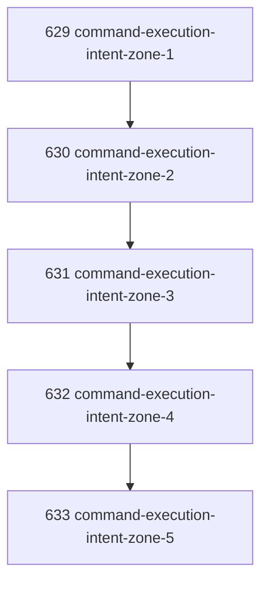

# Command Execution Intent Zone

## Goal

<!-- Goal placeholder -->

## DAG

## Active Tasks

| # | Task | Name | Purpose |
|---|------|------|---------|
| 1 | 629 | command-execution-intent-zone-1 | TBD |
| 2 | 630 | command-execution-intent-zone-2 | TBD |
| 3 | 631 | command-execution-intent-zone-3 | TBD |
| 4 | 632 | command-execution-intent-zone-4 | TBD |
| 5 | 633 | command-execution-intent-zone-5 | TBD |

## CCC Posture

| Coordinate | Evidenced State | Projected State If Chapter Verifies | Pressure Path | Evidence Required |
|------------|-----------------|-------------------------------------|---------------|-------------------|
| semantic_resolution | 0 | 0 | TBD | TBD |
| invariant_preservation | 0 | 0 | TBD | TBD |
| constructive_executability | 0 | 0 | TBD | TBD |
| grounded_universalization | 0 | 0 | TBD | TBD |
| authority_reviewability | 0 | 0 | TBD | TBD |
| teleological_pressure | 0 | 0 | TBD | TBD |

## Deferred Work

| Deferred Capability | Rationale |
|---------------------|-----------|
| **TBD** | TBD |

## Closure Criteria

- [ ] All tasks in this chapter are closed or confirmed.
- [ ] Semantic drift check passes.
- [ ] Gap table produced.
- [ ] CCC posture recorded.
