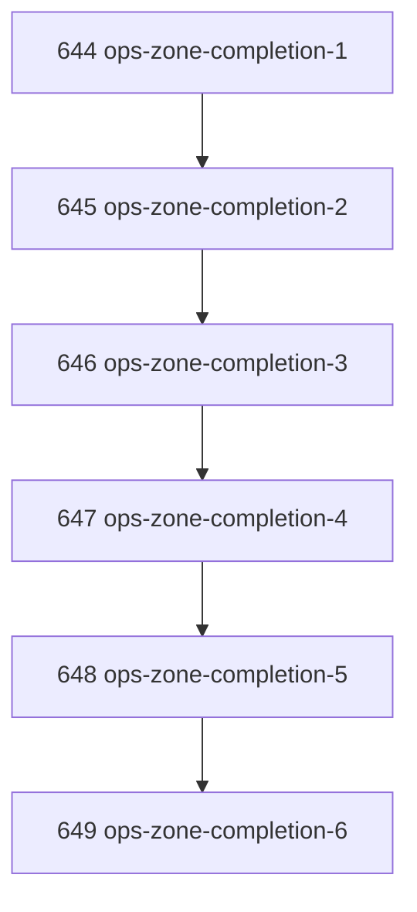

# Ops Zone Completion

## Goal

Complete the simplified inventory of missing Narada buildout ops zones without over-factoring review into a zone. Produce a durable concept artifact and a closed task chain that distinguishes true zones from admission methods and crossing regimes.

## DAG

## Active Tasks

| # | Task | Name | Purpose |
|---|------|------|---------|
| 1 | 644 | Inventory True Missing Ops Zones | Define the simplified zone inventory and reject review as a zone. |
| 2 | 645 | Assignment Intent Zone | Define the missing assignment/claim/continuation authority boundary. |
| 3 | 646 | Evidence Admission Zone | Define work-result admission and classify review as a method. |
| 4 | 647 | Observation Artifact Zone | Define output creation/admission separation for large reads. |
| 5 | 648 | Operator Input Zone | Define durable operator approvals, gates, and choices. |
| 6 | 649 | Reconciliation Zone And Priority Chain | Define drift repair and final implementation order. |

## CCC Posture

| Coordinate | Evidenced State | Projected State If Chapter Verifies | Pressure Path | Evidence Required |
|------------|-----------------|-------------------------------------|---------------|-------------------|
| semantic_resolution | Review was ambiguously treated as a zone | Review is classified as admission method / challenge regime | Simplify taxonomy before implementation | `docs/concepts/ops-zone-completion.md` |
| invariant_preservation | Task ops still have several drift-prone surfaces | Missing zones mapped to artifacts and confirmation rules | Keep zone admission distinct from lifecycle mutation | Child task execution notes |
| constructive_executability | Missing zones were conversational, not actionable | Five prioritized implementation zones exist | Create follow-up-ready inventory | Priority chain in concept doc |
| grounded_universalization | Risk of inventing zones for every command | Zone admission rule prevents over-factoring | Require owner/request/result/admission/confirmation | Closure rule in concept doc |
| authority_reviewability | Review could be mistaken for authority owner | Review is a method on Evidence/Task Lifecycle crossings | Make challenge regime explicit | Task 646 |
| teleological_pressure | Buildout focus was diffuse | Assignment, Evidence, Observation, Operator Input, Reconciliation | Prioritize recurring operational failures | Task 649 |

## Deferred Work

| Deferred Capability | Rationale |
|---------------------|-----------|
| **Implement Assignment Intent Zone** | Highest-priority follow-up after this inventory chapter; should own recommendation, assignment, claim, continuation, and takeover request/result artifacts. |
| **Implement Evidence Admission Zone** | Needed after assignment because work reports, reviews, acceptance criteria, and verification links still need a single admission artifact. |
| **Implement Observation Artifact Zone** | Needed to complete output creation/admission separation beyond current CEIZ bounded excerpts. |

## Closure Criteria

- [x] All tasks in this chapter are closed or confirmed.
- [x] Semantic drift check passes.
- [x] Gap table produced.
- [x] CCC posture recorded.
