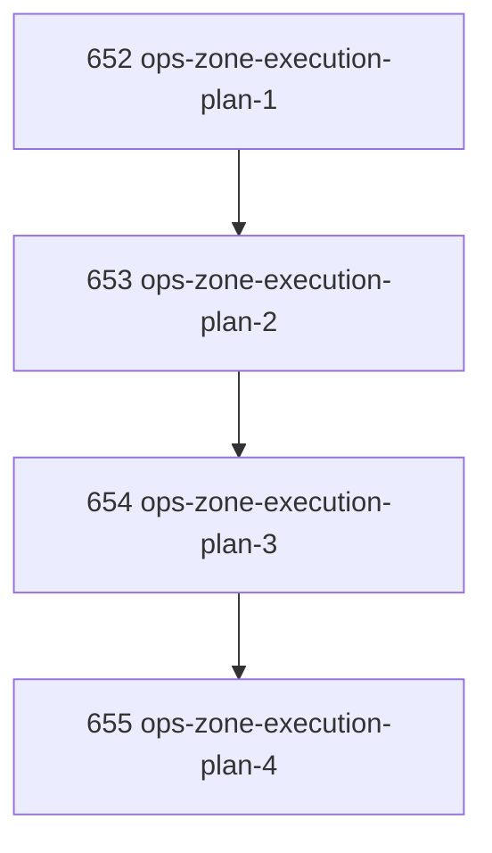

# Ops Zone Execution Plan

## Goal

Plan and sequence implementation of the four highest-value missing ops zones: Assignment Intent, Evidence Admission, Observation Artifact, and Reconciliation. The result should be directly assignable work, not abstract taxonomy.

## DAG

## Active Tasks

| # | Task | Name | Purpose |
|---|------|------|---------|
| 1 | 652 | Assignment Intent Zone Execution | Unify recommend/assign/claim/continue/takeover into one request/result authority path. |
| 2 | 653 | Evidence Admission Zone Execution | Unify report/review/verification/criteria admission into explicit evidence bundles and admission results. |
| 3 | 654 | Observation Artifact Zone Execution | Make large read/output surfaces artifact-first with bounded admitted views. |
| 4 | 655 | Reconciliation Zone Execution | Add sanctioned drift detection and repair request/result path across task SQLite/files/projections. |

## CCC Posture

| Coordinate | Evidenced State | Projected State If Chapter Verifies | Pressure Path | Evidence Required |
|------------|-----------------|-------------------------------------|---------------|-------------------|
| semantic_resolution | Four missing zones identified conceptually | Four executable task plans with artifacts and checks | Convert concepts into implementation tasks | Child task acceptance criteria |
| invariant_preservation | Assignment/evidence/observation/reconciliation still distributed | Each zone gets one owning request/result surface | Prevent authority leakage across command families | Zone-specific task plans |
| constructive_executability | Current state is mostly docs and partial CEIZ/TIZ cuts | First implementation task is immediately claimable | Start with Assignment Intent Zone | Task 652 |
| grounded_universalization | Risk of generic zone theater | Each task lists concrete commands and existing rough surfaces | Bound every zone to implementation work | Required Work sections |
| authority_reviewability | Review/evidence/closure semantics still distributed | Evidence Admission task separates review as method | Make review admission explicit | Task 653 |
| teleological_pressure | Direction could sprawl | Dependency order fixes focus | 652 → 653 → 654 → 655 | DAG |

## Deferred Work

| Deferred Capability | Rationale |
|---------------------|-----------|
| **Operator Input Zone** | Important, but deferred behind the four immediate failures: assignment drift, evidence ambiguity, output dumps, reconciliation gaps. |
| **Agent Session Zone** | Should follow Assignment Intent because assignment requests/results must define how session targeting participates. |

## Closure Criteria

- [x] Child tasks are executable implementation plans.
- [x] Dependency order is explicit.
- [x] Semantic drift check passes.
- [x] Gap table produced.
- [x] CCC posture recorded.
