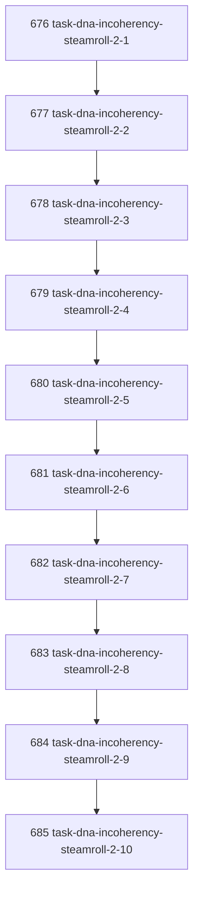

# Task DNA Incoherency Steamroll 2

## Goal

<!-- Goal placeholder -->

## DAG

## Active Tasks

| # | Task | Name | Purpose |
|---|------|------|---------|
| 1 | 676 | task-dna-incoherency-steamroll-2-1 | TBD |
| 2 | 677 | task-dna-incoherency-steamroll-2-2 | TBD |
| 3 | 678 | task-dna-incoherency-steamroll-2-3 | TBD |
| 4 | 679 | task-dna-incoherency-steamroll-2-4 | TBD |
| 5 | 680 | task-dna-incoherency-steamroll-2-5 | TBD |
| 6 | 681 | task-dna-incoherency-steamroll-2-6 | TBD |
| 7 | 682 | task-dna-incoherency-steamroll-2-7 | TBD |
| 8 | 683 | task-dna-incoherency-steamroll-2-8 | TBD |
| 9 | 684 | task-dna-incoherency-steamroll-2-9 | TBD |
| 10 | 685 | task-dna-incoherency-steamroll-2-10 | TBD |

## CCC Posture

| Coordinate | Evidenced State | Projected State If Chapter Verifies | Pressure Path | Evidence Required |
|------------|-----------------|-------------------------------------|---------------|-------------------|
| semantic_resolution | 0 | 0 | TBD | TBD |
| invariant_preservation | 0 | 0 | TBD | TBD |
| constructive_executability | 0 | 0 | TBD | TBD |
| grounded_universalization | 0 | 0 | TBD | TBD |
| authority_reviewability | 0 | 0 | TBD | TBD |
| teleological_pressure | 0 | 0 | TBD | TBD |

## Deferred Work

| Deferred Capability | Rationale |
|---------------------|-----------|
| **TBD** | TBD |

## Closure Criteria

- [ ] All tasks in this chapter are closed or confirmed.
- [ ] Semantic drift check passes.
- [ ] Gap table produced.
- [ ] CCC posture recorded.
