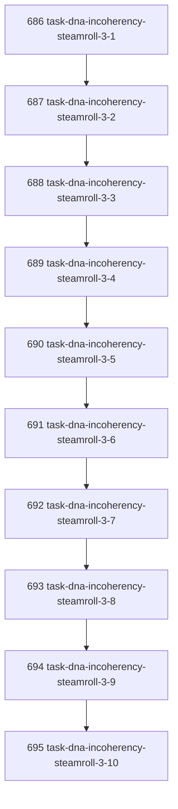

# Task DNA Incoherency Steamroll 3

## Goal

<!-- Goal placeholder -->

## DAG

## Active Tasks

| # | Task | Name | Purpose |
|---|------|------|---------|
| 1 | 686 | task-dna-incoherency-steamroll-3-1 | TBD |
| 2 | 687 | task-dna-incoherency-steamroll-3-2 | TBD |
| 3 | 688 | task-dna-incoherency-steamroll-3-3 | TBD |
| 4 | 689 | task-dna-incoherency-steamroll-3-4 | TBD |
| 5 | 690 | task-dna-incoherency-steamroll-3-5 | TBD |
| 6 | 691 | task-dna-incoherency-steamroll-3-6 | TBD |
| 7 | 692 | task-dna-incoherency-steamroll-3-7 | TBD |
| 8 | 693 | task-dna-incoherency-steamroll-3-8 | TBD |
| 9 | 694 | task-dna-incoherency-steamroll-3-9 | TBD |
| 10 | 695 | task-dna-incoherency-steamroll-3-10 | TBD |

## CCC Posture

| Coordinate | Evidenced State | Projected State If Chapter Verifies | Pressure Path | Evidence Required |
|------------|-----------------|-------------------------------------|---------------|-------------------|
| semantic_resolution | 0 | 0 | TBD | TBD |
| invariant_preservation | 0 | 0 | TBD | TBD |
| constructive_executability | 0 | 0 | TBD | TBD |
| grounded_universalization | 0 | 0 | TBD | TBD |
| authority_reviewability | 0 | 0 | TBD | TBD |
| teleological_pressure | 0 | 0 | TBD | TBD |

## Deferred Work

| Deferred Capability | Rationale |
|---------------------|-----------|
| **TBD** | TBD |

## Closure Criteria

- [ ] All tasks in this chapter are closed or confirmed.
- [ ] Semantic drift check passes.
- [ ] Gap table produced.
- [ ] CCC posture recorded.
