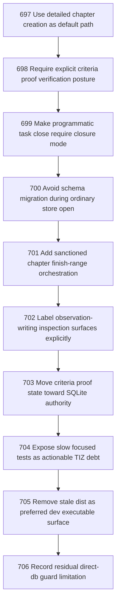

# Task DNA Incoherency Steamroll 4

## Goal

<!-- Goal placeholder -->

## DAG

## Active Tasks

| # | Task | Name | Purpose |
|---|------|------|---------|
| 1 | 697 | Use detailed chapter creation as default path | Create this chapter through chapter init --tasks-file, not placeholder creation followed by amendments. |
| 2 | 698 | Require explicit criteria proof verification posture | Criteria proof must require either a verification run binding or an explicit no-run rationale. |
| 3 | 699 | Make programmatic task close require closure mode | Closure authority choice must be mandatory below the CLI boundary too. |
| 4 | 700 | Avoid schema migration during ordinary store open | Read-oriented CLI opens should not take migration locks when the schema is already current. |
| 5 | 701 | Add sanctioned chapter finish-range orchestration | Closing a chapter range should not require an ad hoc shell loop over task numbers. |
| 6 | 702 | Label observation-writing inspection surfaces explicitly | Commands that are read-only over source state but write observation artifacts must say so clearly. |
| 7 | 703 | Move criteria proof state toward SQLite authority | Criteria proof should be queryable from SQLite authority rather than only visible as checked markdown projection. |
| 8 | 704 | Expose slow focused tests as actionable TIZ debt | Slow focused tests should surface as bounded test-runtime debt rather than tolerated background pain. |
| 9 | 705 | Remove stale dist as preferred dev executable surface | Development shell execution should not prefer compiled dist as a second authority surface. |
| 10 | 706 | Record residual direct-db guard limitation | The DB guard must stop pretending it proves sanctioned provenance when it only detects dirty tracked DB state. |

## CCC Posture

| Coordinate | Evidenced State | Projected State If Chapter Verifies | Pressure Path | Evidence Required |
|------------|-----------------|-------------------------------------|---------------|-------------------|
| semantic_resolution | 0 | 0 | TBD | TBD |
| invariant_preservation | 0 | 0 | TBD | TBD |
| constructive_executability | 0 | 0 | TBD | TBD |
| grounded_universalization | 0 | 0 | TBD | TBD |
| authority_reviewability | 0 | 0 | TBD | TBD |
| teleological_pressure | 0 | 0 | TBD | TBD |

## Deferred Work

| Deferred Capability | Rationale |
|---------------------|-----------|
| **TBD** | TBD |

## Closure Criteria

- [ ] All tasks in this chapter are closed or confirmed.
- [ ] Semantic drift check passes.
- [ ] Gap table produced.
- [ ] CCC posture recorded.
