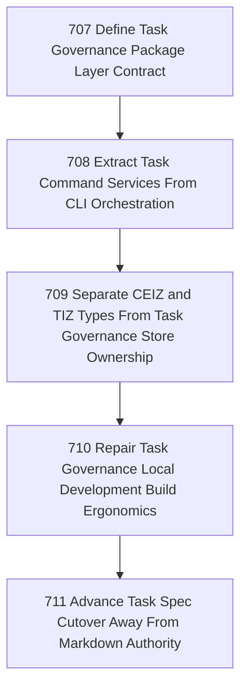

# Task Governance Package Tracks

## Goal

<!-- Goal placeholder -->

## DAG

## Active Tasks

| # | Task | Name | Purpose |
|---|------|------|---------|
| 1 | 707 | Define Task Governance Package Layer Contract | Make the new task-governance package boundary explicit enough that future work can follow rails instead of rediscovering ownership. |
| 2 | 708 | Extract Task Command Services From CLI Orchestration | Move task-domain orchestration out of CLI command files into package-owned services while preserving command behavior. |
| 3 | 709 | Separate CEIZ and TIZ Types From Task Governance Store Ownership | Stop task-governance from conceptually owning command/test intent types merely because its SQLite store currently persists their rows. |
| 4 | 710 | Repair Task Governance Local Development Build Ergonomics | Make package extraction pleasant and non-surprising for agents and operators during local development. |
| 5 | 711 | Advance Task Spec Cutover Away From Markdown Authority | Continue the migration from markdown-shaped task authority to sanctioned command and SQLite-backed task spec authority. |

## CCC Posture

| Coordinate | Evidenced State | Projected State If Chapter Verifies | Pressure Path | Evidence Required |
|------------|-----------------|-------------------------------------|---------------|-------------------|
| semantic_resolution | 0 | 0 | TBD | TBD |
| invariant_preservation | 0 | 0 | TBD | TBD |
| constructive_executability | 0 | 0 | TBD | TBD |
| grounded_universalization | 0 | 0 | TBD | TBD |
| authority_reviewability | 0 | 0 | TBD | TBD |
| teleological_pressure | 0 | 0 | TBD | TBD |

## Deferred Work

| Deferred Capability | Rationale |
|---------------------|-----------|
| **TBD** | TBD |

## Closure Criteria

- [ ] All tasks in this chapter are closed or confirmed.
- [ ] Semantic drift check passes.
- [ ] Gap table produced.
- [ ] CCC posture recorded.
