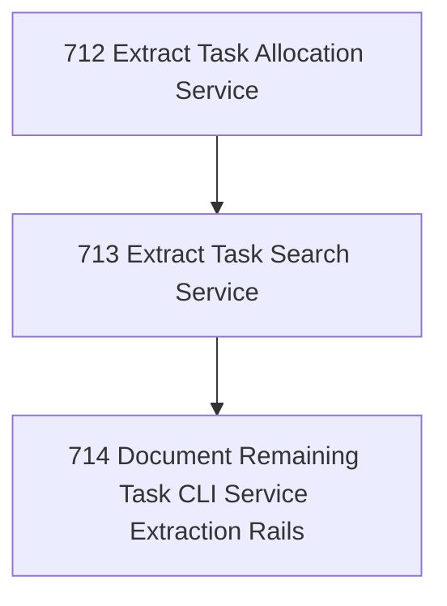

# Task Service Extraction 2

## Goal

<!-- Goal placeholder -->

## DAG

## Active Tasks

| # | Task | Name | Purpose |
|---|------|------|---------|
| 1 | 712 | Extract Task Allocation Service | Move task number allocation operation logic from the CLI command into @narada2/task-governance so CLI allocate is an adapter. |
| 2 | 713 | Extract Task Search Service | Move task search operation logic into @narada2/task-governance so task search uses package-owned projection rules. |
| 3 | 714 | Document Remaining Task CLI Service Extraction Rails | Make the remaining CLI-to-service extraction sequence explicit so future chapters continue on rails. |

## CCC Posture

| Coordinate | Evidenced State | Projected State If Chapter Verifies | Pressure Path | Evidence Required |
|------------|-----------------|-------------------------------------|---------------|-------------------|
| semantic_resolution | 0 | 0 | TBD | TBD |
| invariant_preservation | 0 | 0 | TBD | TBD |
| constructive_executability | 0 | 0 | TBD | TBD |
| grounded_universalization | 0 | 0 | TBD | TBD |
| authority_reviewability | 0 | 0 | TBD | TBD |
| teleological_pressure | 0 | 0 | TBD | TBD |

## Deferred Work

| Deferred Capability | Rationale |
|---------------------|-----------|
| **TBD** | TBD |

## Closure Criteria

- [ ] All tasks in this chapter are closed or confirmed.
- [ ] Semantic drift check passes.
- [ ] Gap table produced.
- [ ] CCC posture recorded.
