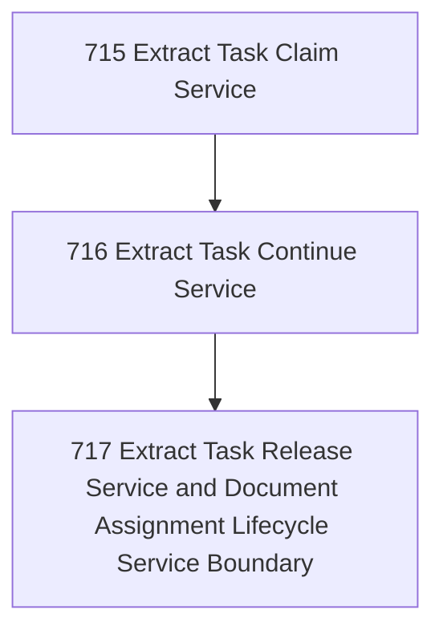

# Task Assignment Lifecycle Service Extraction

## Goal

<!-- Goal placeholder -->

## DAG

## Active Tasks

| # | Task | Name | Purpose |
|---|------|------|---------|
| 1 | 715 | Extract Task Claim Service | Move task claim semantics out of the CLI command into @narada2/task-governance while preserving current command behavior as an adapter. |
| 2 | 716 | Extract Task Continue Service | Move task continue semantics out of the CLI command into @narada2/task-governance while keeping CLI output as adapter-only. |
| 3 | 717 | Extract Task Release Service and Document Assignment Lifecycle Service Boundary | Move task release semantics into @narada2/task-governance and document the resulting assignment lifecycle service boundary. |

## CCC Posture

| Coordinate | Evidenced State | Projected State If Chapter Verifies | Pressure Path | Evidence Required |
|------------|-----------------|-------------------------------------|---------------|-------------------|
| semantic_resolution | 0 | 0 | TBD | TBD |
| invariant_preservation | 0 | 0 | TBD | TBD |
| constructive_executability | 0 | 0 | TBD | TBD |
| grounded_universalization | 0 | 0 | TBD | TBD |
| authority_reviewability | 0 | 0 | TBD | TBD |
| teleological_pressure | 0 | 0 | TBD | TBD |

## Deferred Work

| Deferred Capability | Rationale |
|---------------------|-----------|
| **TBD** | TBD |

## Closure Criteria

- [ ] All tasks in this chapter are closed or confirmed.
- [ ] Semantic drift check passes.
- [ ] Gap table produced.
- [ ] CCC posture recorded.
