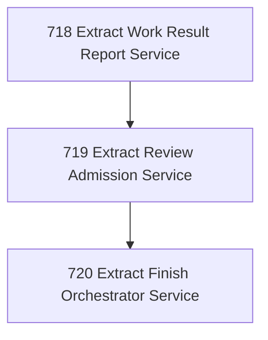

# Task Work-Result, Review, and Finish Service Extraction

## Goal

<!-- Goal placeholder -->

## DAG

## Active Tasks

| # | Task | Name | Purpose |
|---|------|------|---------|
| 1 | 718 | Extract Work Result Report Service | Move task report operator semantics from the CLI command into @narada2/task-governance as a package service that owns work-result submission, assignment intent checks, idempotency, and authoritative store updates. |
| 2 | 719 | Extract Review Admission Service | Move task review operator semantics from the CLI command into @narada2/task-governance so verdict handling, findings validation, evidence admission, and closure orchestration are package-owned. |
| 3 | 720 | Extract Finish Orchestrator Service | Move finish orchestration semantics into @narada2/task-governance so task-finish coordinates report/review, evidence admission, optional criteria proof, close, and roster handoff through package services. |

## CCC Posture

| Coordinate | Evidenced State | Projected State If Chapter Verifies | Pressure Path | Evidence Required |
|------------|-----------------|-------------------------------------|---------------|-------------------|
| semantic_resolution | 0 | 0 | TBD | TBD |
| invariant_preservation | 0 | 0 | TBD | TBD |
| constructive_executability | 0 | 0 | TBD | TBD |
| grounded_universalization | 0 | 0 | TBD | TBD |
| authority_reviewability | 0 | 0 | TBD | TBD |
| teleological_pressure | 0 | 0 | TBD | TBD |

## Deferred Work

| Deferred Capability | Rationale |
|---------------------|-----------|
| **TBD** | TBD |

## Closure Criteria

- [ ] All tasks in this chapter are closed or confirmed.
- [ ] Semantic drift check passes.
- [ ] Gap table produced.
- [ ] CCC posture recorded.
