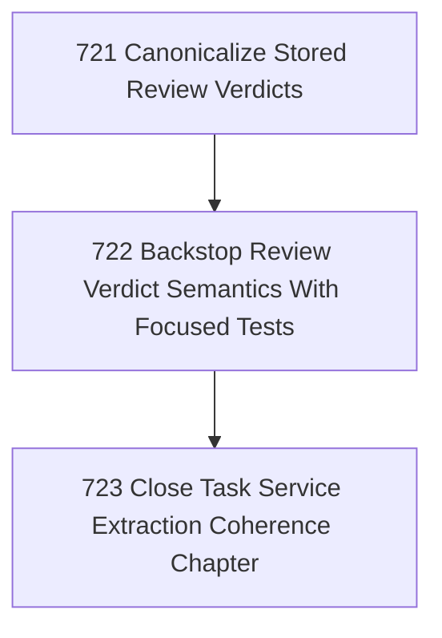

# Task Review Verdict Canonicalization

## Goal

<!-- Goal placeholder -->

## DAG

## Active Tasks

| # | Task | Name | Purpose |
|---|------|------|---------|
| 1 | 721 | Canonicalize Stored Review Verdicts | Make SQLite task review verdict storage use one canonical negative verdict spelling instead of splitting between rejected and needs_changes. |
| 2 | 722 | Backstop Review Verdict Semantics With Focused Tests | Add tests that pin canonical review verdict storage and legacy read compatibility so the alias split cannot reappear. |
| 3 | 723 | Close Task Service Extraction Coherence Chapter | Verify and close the service-extraction coherence chapter after review verdict semantics are canonical and tests pass. |

## CCC Posture

| Coordinate | Evidenced State | Projected State If Chapter Verifies | Pressure Path | Evidence Required |
|------------|-----------------|-------------------------------------|---------------|-------------------|
| semantic_resolution | 0 | 0 | TBD | TBD |
| invariant_preservation | 0 | 0 | TBD | TBD |
| constructive_executability | 0 | 0 | TBD | TBD |
| grounded_universalization | 0 | 0 | TBD | TBD |
| authority_reviewability | 0 | 0 | TBD | TBD |
| teleological_pressure | 0 | 0 | TBD | TBD |

## Deferred Work

| Deferred Capability | Rationale |
|---------------------|-----------|
| **TBD** | TBD |

## Closure Criteria

- [ ] All tasks in this chapter are closed or confirmed.
- [ ] Semantic drift check passes.
- [ ] Gap table produced.
- [ ] CCC posture recorded.
