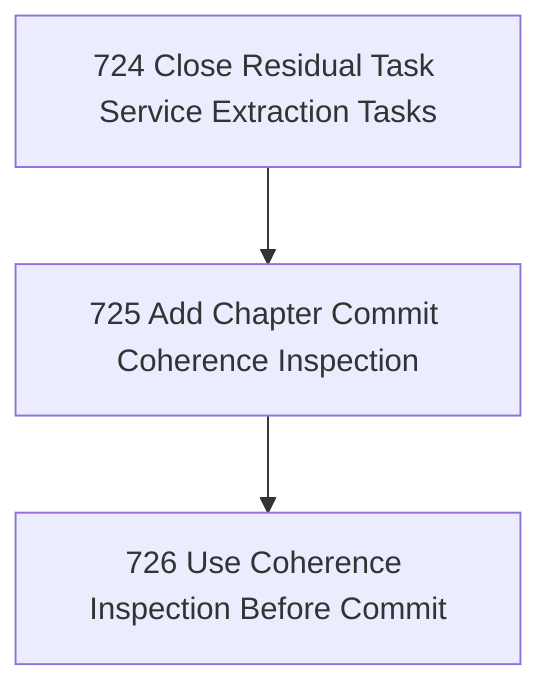

# Chapter Commit Coherence

## Goal

<!-- Goal placeholder -->

## DAG

## Active Tasks

| # | Task | Name | Purpose |
|---|------|------|---------|
| 1 | 724 | Close Residual Task Service Extraction Tasks | Bring tasks 718, 719, and 720 from attempt_complete to evidence-complete closure so the committed service-extraction chapter is not left half-open. |
| 2 | 725 | Add Chapter Commit Coherence Inspection | Provide a small sanctioned inspection surface that detects task ranges with attempt-complete or incomplete tasks before a chapter commit. |
| 3 | 726 | Use Coherence Inspection Before Commit | Run the new chapter commit coherence inspection against the active chapter ranges before committing this chapter. |

## CCC Posture

| Coordinate | Evidenced State | Projected State If Chapter Verifies | Pressure Path | Evidence Required |
|------------|-----------------|-------------------------------------|---------------|-------------------|
| semantic_resolution | 0 | 0 | TBD | TBD |
| invariant_preservation | 0 | 0 | TBD | TBD |
| constructive_executability | 0 | 0 | TBD | TBD |
| grounded_universalization | 0 | 0 | TBD | TBD |
| authority_reviewability | 0 | 0 | TBD | TBD |
| teleological_pressure | 0 | 0 | TBD | TBD |

## Deferred Work

| Deferred Capability | Rationale |
|---------------------|-----------|
| **TBD** | TBD |

## Closure Criteria

- [ ] All tasks in this chapter are closed or confirmed.
- [ ] Semantic drift check passes.
- [ ] Gap table produced.
- [ ] CCC posture recorded.
