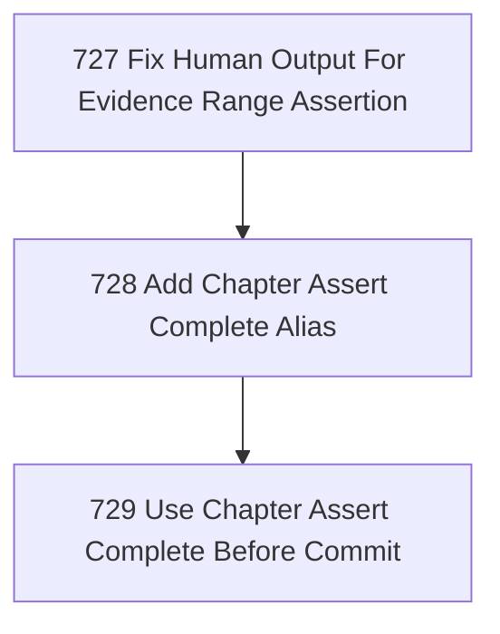

# Chapter Coherence Ergonomics

## Goal

<!-- Goal placeholder -->

## DAG

## Active Tasks

| # | Task | Name | Purpose |
|---|------|------|---------|
| 1 | 727 | Fix Human Output For Evidence Range Assertion | Make `narada task evidence assert-complete <range>` produce readable human/default output instead of `[object Object]`. |
| 2 | 728 | Add Chapter Assert Complete Alias | Expose the coherence check as `narada chapter assert-complete <range>` so the operator can use chapter language for chapter closure. |
| 3 | 729 | Use Chapter Assert Complete Before Commit | Verify the new ergonomic chapter command against recent ranges before committing this ergonomics chapter. |

## CCC Posture

| Coordinate | Evidenced State | Projected State If Chapter Verifies | Pressure Path | Evidence Required |
|------------|-----------------|-------------------------------------|---------------|-------------------|
| semantic_resolution | 0 | 0 | TBD | TBD |
| invariant_preservation | 0 | 0 | TBD | TBD |
| constructive_executability | 0 | 0 | TBD | TBD |
| grounded_universalization | 0 | 0 | TBD | TBD |
| authority_reviewability | 0 | 0 | TBD | TBD |
| teleological_pressure | 0 | 0 | TBD | TBD |

## Deferred Work

| Deferred Capability | Rationale |
|---------------------|-----------|
| **TBD** | TBD |

## Closure Criteria

- [ ] All tasks in this chapter are closed or confirmed.
- [ ] Semantic drift check passes.
- [ ] Gap table produced.
- [ ] CCC posture recorded.
