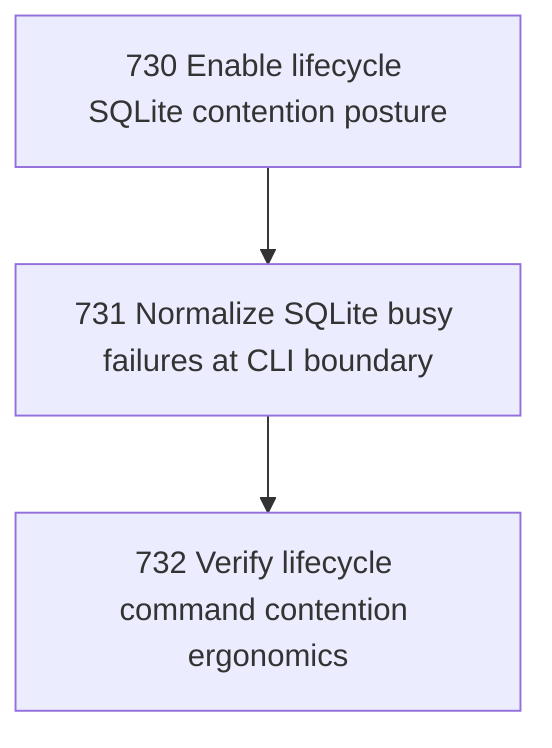

# SQLite Contention Posture

## Goal

<!-- Goal placeholder -->

## DAG

## Active Tasks

| # | Task | Name | Purpose |
|---|------|------|---------|
| 1 | 730 | Enable lifecycle SQLite contention posture | Make task lifecycle SQLite connections tolerate short concurrent CLI writes without immediate SQLITE_BUSY failures. |
| 2 | 731 | Normalize SQLite busy failures at CLI boundary | Prevent raw better-sqlite3 SQLITE_BUSY stack traces from reaching the operator during sanctioned task commands. |
| 3 | 732 | Verify lifecycle command contention ergonomics | Prove the fixed posture works through real command surfaces and record the result as chapter evidence. |

## CCC Posture

| Coordinate | Evidenced State | Projected State If Chapter Verifies | Pressure Path | Evidence Required |
|------------|-----------------|-------------------------------------|---------------|-------------------|
| semantic_resolution | 0 | 0 | TBD | TBD |
| invariant_preservation | 0 | 0 | TBD | TBD |
| constructive_executability | 0 | 0 | TBD | TBD |
| grounded_universalization | 0 | 0 | TBD | TBD |
| authority_reviewability | 0 | 0 | TBD | TBD |
| teleological_pressure | 0 | 0 | TBD | TBD |

## Deferred Work

| Deferred Capability | Rationale |
|---------------------|-----------|
| **TBD** | TBD |

## Closure Criteria

- [ ] All tasks in this chapter are closed or confirmed.
- [ ] Semantic drift check passes.
- [ ] Gap table produced.
- [ ] CCC posture recorded.
