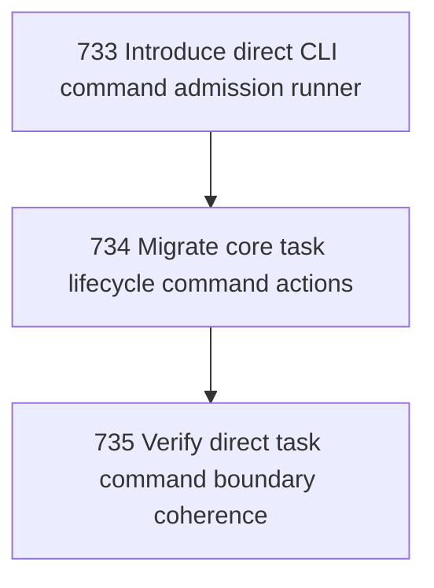

# CLI Command Boundary Unification

## Goal

<!-- Goal placeholder -->

## DAG

## Active Tasks

| # | Task | Name | Purpose |
|---|------|------|---------|
| 1 | 733 | Introduce direct CLI command admission runner | Replace ad hoc direct command result/error/exit handling with one reusable runner for commands that are not yet using wrapCommand. |
| 2 | 734 | Migrate core task lifecycle command actions | Remove duplicated direct result/error/exit handling from the core task lifecycle commands. |
| 3 | 735 | Verify direct task command boundary coherence | Prove the migrated command boundary remains build-clean and operational through real task/chapter paths. |

## CCC Posture

| Coordinate | Evidenced State | Projected State If Chapter Verifies | Pressure Path | Evidence Required |
|------------|-----------------|-------------------------------------|---------------|-------------------|
| semantic_resolution | 0 | 0 | TBD | TBD |
| invariant_preservation | 0 | 0 | TBD | TBD |
| constructive_executability | 0 | 0 | TBD | TBD |
| grounded_universalization | 0 | 0 | TBD | TBD |
| authority_reviewability | 0 | 0 | TBD | TBD |
| teleological_pressure | 0 | 0 | TBD | TBD |

## Deferred Work

| Deferred Capability | Rationale |
|---------------------|-----------|
| **TBD** | TBD |

## Closure Criteria

- [ ] All tasks in this chapter are closed or confirmed.
- [ ] Semantic drift check passes.
- [ ] Gap table produced.
- [ ] CCC posture recorded.
