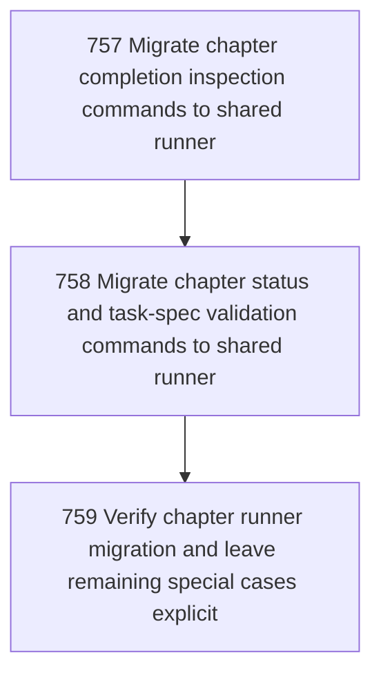

# Chapter Runner Migration

## Goal

<!-- Goal placeholder -->

## DAG

## Active Tasks

| # | Task | Name | Purpose |
|---|------|------|---------|
| 1 | 757 | Migrate chapter completion inspection commands to shared runner | Route chapter finish-range and chapter assert-complete through the shared direct-command boundary so success output, nonzero results, and thrown errors are admitted consistently. |
| 2 | 758 | Migrate chapter status and task-spec validation commands to shared runner | Remove bespoke output admission from chapter status and chapter validate-tasks-file while preserving their read/validation semantics. |
| 3 | 759 | Verify chapter runner migration and leave remaining special cases explicit | Prove the migrated chapter commands remain functional and record why any remaining chapter commands still use bespoke handling. |

## CCC Posture

| Coordinate | Evidenced State | Projected State If Chapter Verifies | Pressure Path | Evidence Required |
|------------|-----------------|-------------------------------------|---------------|-------------------|
| semantic_resolution | 0 | 0 | TBD | TBD |
| invariant_preservation | 0 | 0 | TBD | TBD |
| constructive_executability | 0 | 0 | TBD | TBD |
| grounded_universalization | 0 | 0 | TBD | TBD |
| authority_reviewability | 0 | 0 | TBD | TBD |
| teleological_pressure | 0 | 0 | TBD | TBD |

## Deferred Work

| Deferred Capability | Rationale |
|---------------------|-----------|
| **TBD** | TBD |

## Closure Criteria

- [ ] All tasks in this chapter are closed or confirmed.
- [ ] Semantic drift check passes.
- [ ] Gap table produced.
- [ ] CCC posture recorded.
