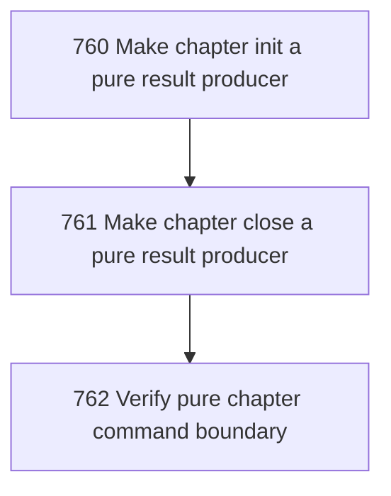

# Chapter Pure Result Boundary

## Goal

<!-- Goal placeholder -->

## DAG

## Active Tasks

| # | Task | Name | Purpose |
|---|------|------|---------|
| 1 | 760 | Make chapter init a pure result producer | Remove formatter-side stdout writes from chapter init so the CLI boundary owns all output admission. |
| 2 | 761 | Make chapter close a pure result producer | Remove formatter-side stdout writes from chapter close so legacy and range closure outputs pass through the same output boundary. |
| 3 | 762 | Verify pure chapter command boundary | Prove all chapter governance commands now use a single output/error admission boundary or have a documented exception. |

## CCC Posture

| Coordinate | Evidenced State | Projected State If Chapter Verifies | Pressure Path | Evidence Required |
|------------|-----------------|-------------------------------------|---------------|-------------------|
| semantic_resolution | 0 | 0 | TBD | TBD |
| invariant_preservation | 0 | 0 | TBD | TBD |
| constructive_executability | 0 | 0 | TBD | TBD |
| grounded_universalization | 0 | 0 | TBD | TBD |
| authority_reviewability | 0 | 0 | TBD | TBD |
| teleological_pressure | 0 | 0 | TBD | TBD |

## Deferred Work

| Deferred Capability | Rationale |
|---------------------|-----------|
| **TBD** | TBD |

## Closure Criteria

- [ ] All tasks in this chapter are closed or confirmed.
- [ ] Semantic drift check passes.
- [ ] Gap table produced.
- [ ] CCC posture recorded.
