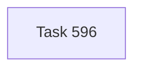

# Chapter DAG — Windows User Site Doctor (Tasks 596–596)

> Self-standing chapter for validating the Windows User Site as a coherent local root.

---

## Chapter Goal

Give the User Site an executable local trust check before future work treats it as a durable operator surface.

---

## Task DAG

| Task | Title | Purpose |
|------|-------|---------|
| **596** | Validate Windows User Site root posture and lifecycle | Add `narada sites doctor <site-id>` for User Site root policy, config identity, sync posture, registry, and task lifecycle schema |

---

## Closure

Implemented and verified against `C:\Users\Andrey\Narada` / `andrey-user`. The doctor reported `passed` with all checks passing.
