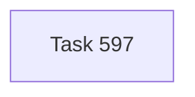

# Chapter DAG — Git Backed User Site Doctor (Tasks 597–597)

> Self-standing chapter for tightening `narada sites doctor` around Git-backed User Sites.

---

## Chapter Goal

Make `git_backed` an inspectable posture rather than a string accepted by config validation.

---

## Task DAG

| Task | Title | Purpose |
|------|-------|---------|
| **597** | Validate git-backed User Site remote posture | Extend `narada sites doctor` to validate Git work tree, upstream, origin URL, configured remote status, and GitHub privacy/reachability |

---

## Closure

Implemented and verified against `C:\Users\Andrey\Narada` / `andrey-user`. The doctor now reports Git-backed checks and passes for the live private GitHub-backed User Site.
