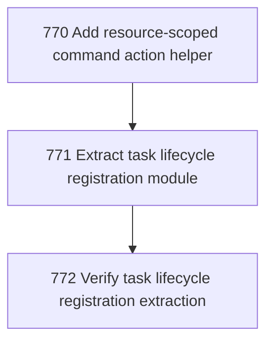

# Task Lifecycle Registration Extraction

## Goal

<!-- Goal placeholder -->

## DAG

## Active Tasks

| # | Task | Name | Purpose |
|---|------|------|---------|
| 1 | 770 | Add resource-scoped command action helper | Reduce repeated resource-scoped command registration boilerplate without changing runDirectCommandWithResource semantics. |
| 2 | 771 | Extract task lifecycle registration module | Move task lifecycle command registrations out of main.ts into a focused command-family registration module. |
| 3 | 772 | Verify task lifecycle registration extraction | Prove lifecycle registration extraction preserves behavior and leaves remaining main.ts pressure explicit. |

## CCC Posture

| Coordinate | Evidenced State | Projected State If Chapter Verifies | Pressure Path | Evidence Required |
|------------|-----------------|-------------------------------------|---------------|-------------------|
| semantic_resolution | 0 | 0 | TBD | TBD |
| invariant_preservation | 0 | 0 | TBD | TBD |
| constructive_executability | 0 | 0 | TBD | TBD |
| grounded_universalization | 0 | 0 | TBD | TBD |
| authority_reviewability | 0 | 0 | TBD | TBD |
| teleological_pressure | 0 | 0 | TBD | TBD |

## Deferred Work

| Deferred Capability | Rationale |
|---------------------|-----------|
| **TBD** | TBD |

## Closure Criteria

- [ ] All tasks in this chapter are closed or confirmed.
- [ ] Semantic drift check passes.
- [ ] Gap table produced.
- [ ] CCC posture recorded.
