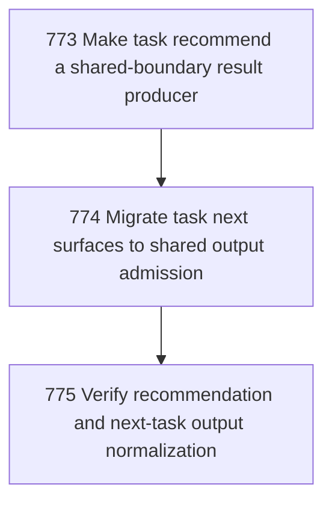

# Recommend Next Output Normalization

## Goal

<!-- Goal placeholder -->

## DAG

## Active Tasks

| # | Task | Name | Purpose |
|---|------|------|---------|
| 1 | 773 | Make task recommend a shared-boundary result producer | Remove bespoke CLI output handling from task recommend while preserving no-recommendation exit semantics. |
| 2 | 774 | Migrate task next surfaces to shared output admission | Route peek-next, pull-next, and work-next through the shared direct-command boundary. |
| 3 | 775 | Verify recommendation and next-task output normalization | Prove the daily agent/operator next-work surfaces are coherent with the shared CLI output boundary. |

## CCC Posture

| Coordinate | Evidenced State | Projected State If Chapter Verifies | Pressure Path | Evidence Required |
|------------|-----------------|-------------------------------------|---------------|-------------------|
| semantic_resolution | 0 | 0 | TBD | TBD |
| invariant_preservation | 0 | 0 | TBD | TBD |
| constructive_executability | 0 | 0 | TBD | TBD |
| grounded_universalization | 0 | 0 | TBD | TBD |
| authority_reviewability | 0 | 0 | TBD | TBD |
| teleological_pressure | 0 | 0 | TBD | TBD |

## Deferred Work

| Deferred Capability | Rationale |
|---------------------|-----------|
| **TBD** | TBD |

## Closure Criteria

- [ ] All tasks in this chapter are closed or confirmed.
- [ ] Semantic drift check passes.
- [ ] Gap table produced.
- [ ] CCC posture recorded.
